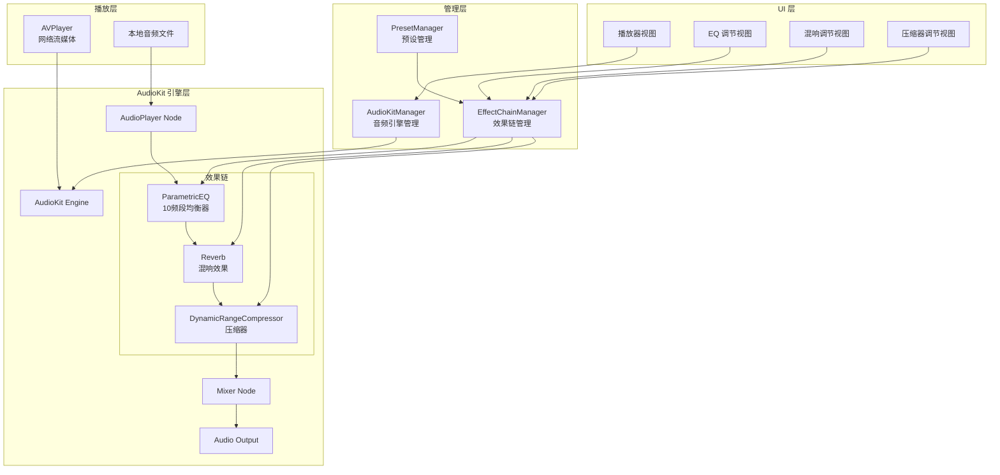
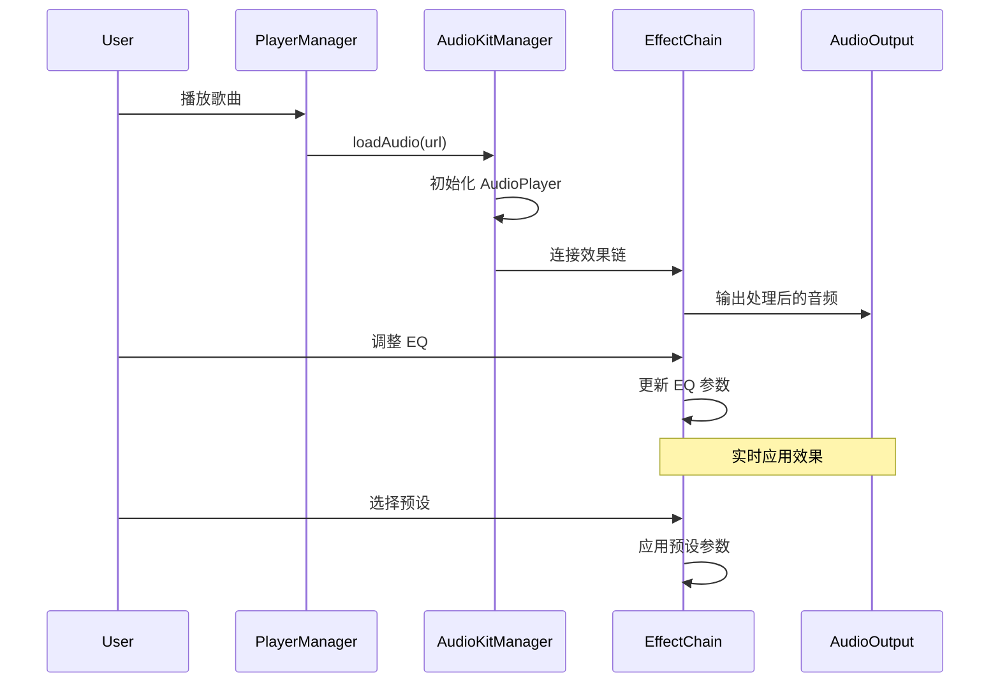

# 设计文档

## 概述

本设计文档描述了在 AsideMusic 应用中全面集成 AudioKit 框架的技术方案。由于 AudioKit 原生不支持 URL 流播放，我们采用混合架构：使用 AVPlayer 进行音频流获取和解码，通过 AVAudioEngine 的 tap 机制将音频数据路由到 AudioKit 效果链进行处理。

### 设计决策

1. **混合播放架构**: AVPlayer 负责网络流媒体处理，AudioKit 负责音频效果处理
2. **效果链设计**: 采用可插拔的效果节点架构，支持动态添加/移除效果
3. **线程安全**: 所有音频处理在专用音频线程执行，UI 更新通过 MainActor 调度
4. **预设系统**: 使用 Codable 协议实现预设的序列化和持久化

## 架构

### 整体架构图



### 数据流图



## 组件和接口

### 1. AudioKitManager

核心音频引擎管理器，负责 AudioKit 引擎的生命周期管理。

```swift
import AudioKit
import AVFoundation

@MainActor
final class AudioKitManager: ObservableObject {
    static let shared = AudioKitManager()
    
    // MARK: - Published Properties
    @Published private(set) var isEngineRunning: Bool = false
    @Published private(set) var currentTime: Double = 0
    @Published private(set) var duration: Double = 0
    @Published private(set) var isPlaying: Bool = false
    @Published private(set) var isLoading: Bool = false
    
    // MARK: - AudioKit Components
    private let engine = AudioEngine()
    private var player: AudioPlayer?
    private var effectChain: EffectChainManager?
    
    // MARK: - Lifecycle
    func startEngine() async throws
    func stopEngine()
    
    // MARK: - Playback
    func loadAudio(from url: URL) async throws
    func play()
    func pause()
    func stop()
    func seek(to time: Double)
    
    // MARK: - Effect Chain
    func connectEffectChain(_ chain: EffectChainManager)
}
```

### 2. EffectChainManager

效果链管理器，负责管理和连接所有音频效果节点。

```swift
import AudioKit
import SoundpipeAudioKit

final class EffectChainManager: ObservableObject {
    // MARK: - Effect Nodes
    @Published var eqProcessor: EQProcessor
    @Published var reverbProcessor: ReverbProcessor
    @Published var compressorProcessor: CompressorProcessor
    
    // MARK: - State
    @Published var isEnabled: Bool = true
    @Published var effectOrder: [EffectType] = [.eq, .compressor, .reverb]
    
    // MARK: - Chain Management
    var inputNode: Node { get }
    var outputNode: Node { get }
    
    func rebuildChain()
    func setEffectEnabled(_ type: EffectType, enabled: Bool)
    func reorderEffects(_ newOrder: [EffectType])
    
    // MARK: - Persistence
    func saveConfiguration()
    func loadConfiguration()
}

enum EffectType: String, Codable, CaseIterable {
    case eq
    case reverb
    case compressor
}
```

### 3. EQProcessor

10 频段参数均衡器处理器。

```swift
import AudioKit
import SoundpipeAudioKit

final class EQProcessor: ObservableObject {
    // MARK: - Constants
    static let bandCount = 10
    static let frequencies: [Float] = [32, 64, 125, 250, 500, 1000, 2000, 4000, 8000, 16000]
    static let minGain: Float = -12.0
    static let maxGain: Float = 12.0
    
    // MARK: - Published Properties
    @Published var bands: [EQBand]
    @Published var isEnabled: Bool = true
    @Published var globalGain: Float = 0.0
    
    // MARK: - AudioKit Nodes
    private var eqNodes: [ParametricEQ]
    private var mixer: Mixer
    
    // MARK: - Interface
    var inputNode: Node { get }
    var outputNode: Node { get }
    
    func setGain(forBand index: Int, gain: Float)
    func setAllGains(_ gains: [Float])
    func reset()
    func applyPreset(_ preset: EQPreset)
}

struct EQBand: Identifiable, Codable {
    let id: Int
    let frequency: Float
    var gain: Float
    var q: Float
}
```

### 4. ReverbProcessor

混响效果处理器。

```swift
import AudioKit
import SoundpipeAudioKit

final class ReverbProcessor: ObservableObject {
    // MARK: - Published Properties
    @Published var dryWetMix: Float = 0.3  // 0.0 - 1.0
    @Published var decayTime: Float = 1.5   // 秒
    @Published var roomSize: Float = 0.5    // 0.0 - 1.0
    @Published var isEnabled: Bool = false
    
    // MARK: - AudioKit Node
    private var reverb: Reverb
    private var dryWetMixer: DryWetMixer
    
    // MARK: - Interface
    var inputNode: Node { get }
    var outputNode: Node { get }
    
    func applyPreset(_ preset: ReverbPreset)
    func reset()
}
```

### 5. CompressorProcessor

动态范围压缩器处理器。

```swift
import AudioKit
import SoundpipeAudioKit

final class CompressorProcessor: ObservableObject {
    // MARK: - Published Properties
    @Published var threshold: Float = -20.0  // dB
    @Published var ratio: Float = 4.0        // 压缩比
    @Published var attackTime: Float = 0.01  // 秒
    @Published var releaseTime: Float = 0.1  // 秒
    @Published var makeupGain: Float = 0.0   // dB
    @Published var isEnabled: Bool = false
    
    // MARK: - AudioKit Node
    private var compressor: DynamicRangeCompressor
    private var dryWetMixer: DryWetMixer
    
    // MARK: - Interface
    var inputNode: Node { get }
    var outputNode: Node { get }
    
    func reset()
}
```

### 6. PresetManager

预设管理器，负责内置预设和用户自定义预设的管理。

```swift
final class PresetManager: ObservableObject {
    static let shared = PresetManager()
    
    // MARK: - Published Properties
    @Published var eqPresets: [EQPreset]
    @Published var reverbPresets: [ReverbPreset]
    @Published var currentEQPreset: EQPreset?
    @Published var currentReverbPreset: ReverbPreset?
    
    // MARK: - Built-in Presets
    static let builtInEQPresets: [EQPreset]
    static let builtInReverbPresets: [ReverbPreset]
    
    // MARK: - Custom Presets
    func saveCustomEQPreset(name: String, bands: [EQBand])
    func saveCustomReverbPreset(name: String, settings: ReverbSettings)
    func deleteCustomPreset(_ preset: any AudioPreset)
    
    // MARK: - Persistence
    func loadPresets()
    func savePresets()
}
```

## 数据模型

### EQ 预设模型

```swift
struct EQPreset: Identifiable, Codable {
    let id: UUID
    let name: String
    let isBuiltIn: Bool
    let gains: [Float]  // 10 个频段的增益值
    let globalGain: Float
    
    // 内置预设
    static let flat = EQPreset(
        id: UUID(),
        name: "平坦",
        isBuiltIn: true,
        gains: [0, 0, 0, 0, 0, 0, 0, 0, 0, 0],
        globalGain: 0
    )
    
    static let pop = EQPreset(
        id: UUID(),
        name: "流行",
        isBuiltIn: true,
        gains: [-1, 2, 4, 3, 1, 0, 1, 2, 3, 2],
        globalGain: 0
    )
    
    static let rock = EQPreset(
        id: UUID(),
        name: "摇滚",
        isBuiltIn: true,
        gains: [4, 3, 1, 0, -1, 0, 2, 3, 4, 4],
        globalGain: 0
    )
    
    static let classical = EQPreset(
        id: UUID(),
        name: "古典",
        isBuiltIn: true,
        gains: [3, 2, 1, 0, 0, 0, 0, 1, 2, 3],
        globalGain: 0
    )
    
    static let jazz = EQPreset(
        id: UUID(),
        name: "爵士",
        isBuiltIn: true,
        gains: [2, 1, 0, 1, 2, 2, 1, 2, 3, 3],
        globalGain: 0
    )
    
    static let electronic = EQPreset(
        id: UUID(),
        name: "电子",
        isBuiltIn: true,
        gains: [5, 4, 2, 0, -1, 0, 1, 3, 4, 5],
        globalGain: 0
    )
    
    static let vocal = EQPreset(
        id: UUID(),
        name: "人声",
        isBuiltIn: true,
        gains: [-2, -1, 0, 2, 4, 4, 3, 1, 0, -1],
        globalGain: 0
    )
    
    static let bassBoost = EQPreset(
        id: UUID(),
        name: "低音增强",
        isBuiltIn: true,
        gains: [6, 5, 4, 2, 0, 0, 0, 0, 0, 0],
        globalGain: 0
    )
    
    static let trebleBoost = EQPreset(
        id: UUID(),
        name: "高音增强",
        isBuiltIn: true,
        gains: [0, 0, 0, 0, 0, 1, 2, 4, 5, 6],
        globalGain: 0
    )
}
```

### 混响预设模型

```swift
struct ReverbPreset: Identifiable, Codable {
    let id: UUID
    let name: String
    let isBuiltIn: Bool
    let dryWetMix: Float
    let decayTime: Float
    let roomSize: Float
    
    static let smallRoom = ReverbPreset(
        id: UUID(),
        name: "小房间",
        isBuiltIn: true,
        dryWetMix: 0.2,
        decayTime: 0.5,
        roomSize: 0.2
    )
    
    static let mediumHall = ReverbPreset(
        id: UUID(),
        name: "中型大厅",
        isBuiltIn: true,
        dryWetMix: 0.3,
        decayTime: 1.5,
        roomSize: 0.5
    )
    
    static let largeHall = ReverbPreset(
        id: UUID(),
        name: "大型大厅",
        isBuiltIn: true,
        dryWetMix: 0.4,
        decayTime: 2.5,
        roomSize: 0.7
    )
    
    static let church = ReverbPreset(
        id: UUID(),
        name: "教堂",
        isBuiltIn: true,
        dryWetMix: 0.5,
        decayTime: 4.0,
        roomSize: 0.9
    )
    
    static let studio = ReverbPreset(
        id: UUID(),
        name: "录音室",
        isBuiltIn: true,
        dryWetMix: 0.15,
        decayTime: 0.8,
        roomSize: 0.3
    )
}
```

### 效果链配置模型

```swift
struct EffectChainConfiguration: Codable {
    var isEnabled: Bool
    var effectOrder: [EffectType]
    var eqSettings: EQSettings
    var reverbSettings: ReverbSettings
    var compressorSettings: CompressorSettings
    var lastEQPresetId: UUID?
    var lastReverbPresetId: UUID?
}

struct EQSettings: Codable {
    var isEnabled: Bool
    var bands: [EQBand]
    var globalGain: Float
}

struct ReverbSettings: Codable {
    var isEnabled: Bool
    var dryWetMix: Float
    var decayTime: Float
    var roomSize: Float
}

struct CompressorSettings: Codable {
    var isEnabled: Bool
    var threshold: Float
    var ratio: Float
    var attackTime: Float
    var releaseTime: Float
    var makeupGain: Float
}
```


## 正确性属性

*正确性属性是一种应该在系统所有有效执行中保持为真的特征或行为——本质上是关于系统应该做什么的形式化陈述。属性作为人类可读规范和机器可验证正确性保证之间的桥梁。*

### Property 1: 播放器状态转换一致性

*对于任意* 播放器实例和任意有效的状态转换序列（play → pause → play → stop），播放器的 `isPlaying` 状态应该与最后执行的操作一致。

**验证: 需求 2.3**

### Property 2: Seek 操作准确性

*对于任意* 已加载的音频和任意有效的目标时间 t（0 ≤ t ≤ duration），执行 seek(to: t) 后，currentTime 应该在 t 的合理误差范围内（±0.1秒）。

**验证: 需求 2.4**

### Property 3: 时间信息有效性

*对于任意* 已加载的音频，duration 应该大于 0，且 currentTime 应该始终满足 0 ≤ currentTime ≤ duration。

**验证: 需求 2.5**

### Property 4: 音频效果参数 Round-Trip

*对于任意* 音频效果处理器（EQ、Reverb、Compressor）和任意有效的参数值，设置参数后立即读取应该返回相同的值（或在浮点精度范围内相等）。

**验证: 需求 3.2, 3.3, 4.2, 4.3, 4.4, 5.2, 5.3, 5.4, 5.5**

### Property 5: 效果 Bypass 状态切换

*对于任意* 音频效果处理器，切换 bypass 状态后，`isEnabled` 属性应该反映新的状态。连续切换两次应该恢复到原始状态。

**验证: 需求 3.6, 4.6, 5.6**

### Property 6: 效果链顺序管理

*对于任意* 有效的效果顺序排列（EffectType 数组的任意排列），设置效果顺序后读取应该返回相同的顺序。

**验证: 需求 6.3**

### Property 7: 效果链配置持久化 Round-Trip

*对于任意* 有效的效果链配置（包括所有效果的参数和启用状态），保存配置后重新加载应该得到等价的配置。

**验证: 需求 6.5, 6.6**

### Property 8: 预设应用一致性

*对于任意* EQ 或 Reverb 预设，应用预设后，对应处理器的参数应该与预设定义的值一致。

**验证: 需求 7.3**

### Property 9: 预设管理 Round-Trip

*对于任意* 自定义预设，创建并保存后应该能够检索到该预设；删除后应该无法检索到该预设。预设的持久化存储应该在应用重启后保持一致。

**验证: 需求 7.4, 7.5, 7.6**

## 错误处理

### 音频引擎错误

```swift
enum AudioKitError: Error, LocalizedError {
    case engineStartFailed(underlying: Error)
    case audioLoadFailed(url: URL, underlying: Error)
    case invalidAudioFormat(format: String)
    case effectChainError(description: String)
    case presetLoadFailed(presetId: UUID)
    case presetSaveFailed(underlying: Error)
    
    var errorDescription: String? {
        switch self {
        case .engineStartFailed(let error):
            return "音频引擎启动失败: \(error.localizedDescription)"
        case .audioLoadFailed(let url, let error):
            return "无法加载音频 \(url): \(error.localizedDescription)"
        case .invalidAudioFormat(let format):
            return "不支持的音频格式: \(format)"
        case .effectChainError(let description):
            return "效果链错误: \(description)"
        case .presetLoadFailed(let presetId):
            return "无法加载预设: \(presetId)"
        case .presetSaveFailed(let error):
            return "保存预设失败: \(error.localizedDescription)"
        }
    }
}
```

### 错误处理策略

1. **引擎启动失败**: 记录错误日志，显示用户友好的错误提示，回退到无效果播放模式
2. **音频加载失败**: 通知 PlayerManager，由其处理重试或跳过逻辑
3. **效果链错误**: 禁用出错的效果节点，继续播放
4. **预设错误**: 使用默认预设，记录错误日志

### 降级策略

```swift
extension AudioKitManager {
    func handleEngineError(_ error: Error) {
        Logger.audio.error("AudioKit 引擎错误: \(error)")
        
        // 尝试重启引擎
        Task {
            do {
                stopEngine()
                try await startEngine()
            } catch {
                // 降级到无效果模式
                effectChain?.isEnabled = false
                Logger.audio.warning("降级到无效果播放模式")
            }
        }
    }
}
```

## 测试策略

### 单元测试

单元测试用于验证具体示例和边界情况：

1. **EQProcessor 测试**
   - 验证 10 个频段的存在
   - 验证频率范围覆盖 20Hz-20kHz
   - 验证增益边界值（-12dB, +12dB）

2. **PresetManager 测试**
   - 验证内置 EQ 预设数量 ≥ 8
   - 验证内置混响预设数量 ≥ 5
   - 验证预设加载和保存

3. **EffectChainManager 测试**
   - 验证效果链连接
   - 验证效果顺序调整

### 属性测试

属性测试用于验证跨所有输入的通用属性。使用 swift-testing 框架配合自定义生成器。

**测试配置**:
- 每个属性测试最少运行 100 次迭代
- 每个测试必须用注释引用设计文档中的属性
- 标签格式: **Feature: audiokit-integration, Property {number}: {property_text}**

**属性测试示例**:

```swift
import Testing

@Suite("AudioKit Integration Property Tests")
struct AudioKitPropertyTests {
    
    // Feature: audiokit-integration, Property 4: 音频效果参数 Round-Trip
    @Test(arguments: generateEQGainValues())
    func eqGainRoundTrip(gain: Float) async throws {
        let eq = EQProcessor()
        for bandIndex in 0..<EQProcessor.bandCount {
            eq.setGain(forBand: bandIndex, gain: gain)
            let readGain = eq.bands[bandIndex].gain
            #expect(abs(readGain - gain) < 0.001)
        }
    }
    
    // Feature: audiokit-integration, Property 5: 效果 Bypass 状态切换
    @Test
    func bypassStateToggle() async throws {
        let eq = EQProcessor()
        let initialState = eq.isEnabled
        
        eq.isEnabled.toggle()
        #expect(eq.isEnabled != initialState)
        
        eq.isEnabled.toggle()
        #expect(eq.isEnabled == initialState)
    }
    
    // Feature: audiokit-integration, Property 7: 效果链配置持久化 Round-Trip
    @Test(arguments: generateEffectChainConfigurations())
    func effectChainConfigRoundTrip(config: EffectChainConfiguration) async throws {
        let manager = EffectChainManager()
        manager.applyConfiguration(config)
        manager.saveConfiguration()
        
        let newManager = EffectChainManager()
        newManager.loadConfiguration()
        
        #expect(newManager.currentConfiguration == config)
    }
}

// 生成器函数
func generateEQGainValues() -> [Float] {
    var values: [Float] = []
    for _ in 0..<100 {
        values.append(Float.random(in: -12...12))
    }
    return values
}

func generateEffectChainConfigurations() -> [EffectChainConfiguration] {
    // 生成随机配置
    var configs: [EffectChainConfiguration] = []
    for _ in 0..<100 {
        configs.append(EffectChainConfiguration.random())
    }
    return configs
}
```

### 集成测试

集成测试验证组件之间的交互：

1. **PlayerManager + AudioKitManager 集成**
   - 验证播放流程端到端工作
   - 验证效果应用到实际音频输出

2. **系统集成**
   - 验证后台播放
   - 验证锁屏控制
   - 验证音频会话中断处理

### 测试覆盖目标

- 单元测试覆盖率: ≥ 80%
- 属性测试: 覆盖所有 9 个正确性属性
- 集成测试: 覆盖主要用户流程
