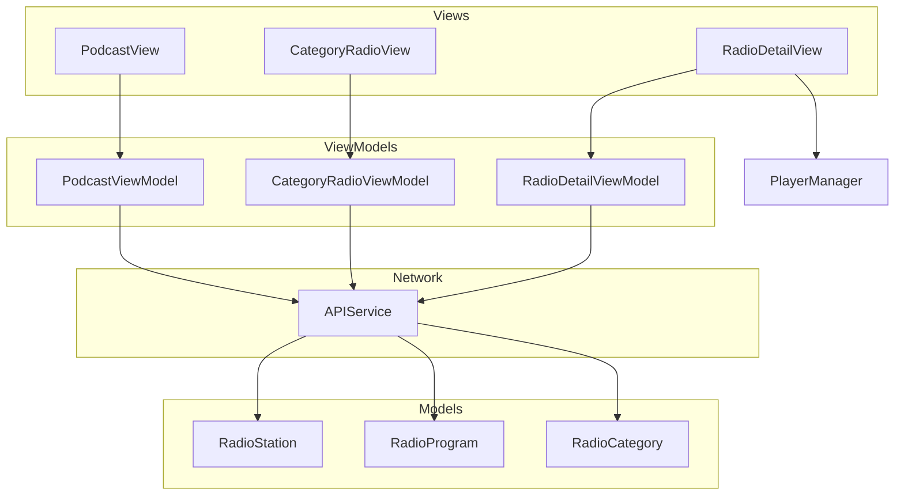
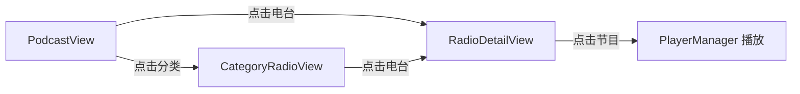

# 设计文档：播客功能

## 概述

为 AsideMusic 应用的播客 tab 实现完整的电台/播客功能。该功能遵循现有的 MVVM 架构模式，使用 Combine 进行网络请求，使用 NavigationStack 管理导航，并复用现有设计系统（颜色、字体、组件）。

主要包含三个页面：
- **PodcastView**：播客主页，展示推荐电台、分类入口、精选电台
- **CategoryRadioView**：分类电台列表页，展示某分类下的热门电台（支持分页）
- **RadioDetailView**：电台详情页，展示电台信息和节目列表（支持分页播放）

## 架构



### 导航流程



## 组件与接口

### 1. PodcastView（播客主页）

替换 ContentView 中的播客 tab 占位文本。使用 NavigationStack 管理导航。

```swift
struct PodcastView: View {
    @StateObject private var viewModel = PodcastViewModel()
    @State private var navigationPath = NavigationPath()

    // 导航目标枚举
    enum PodcastDestination: Hashable {
        case category(RadioCategory)
        case radioDetail(Int) // radioId
    }
}
```

页面结构：
- 顶部标题栏（"播客" 标题）
- 电台分类入口（横向滚动，展示分类图标/名称）
- 个性推荐电台区域（横向滚动卡片）
- 精选电台推荐区域（横向滚动卡片）

### 2. PodcastViewModel

```swift
@MainActor
class PodcastViewModel: ObservableObject {
    @Published var personalizedRadios: [RadioStation] = []
    @Published var categories: [RadioCategory] = []
    @Published var recommendRadios: [RadioStation] = []
    @Published var isLoading = false
    @Published var errorMessage: String?

    private var cancellables = Set<AnyCancellable>()
    private let apiService = APIService.shared

    func fetchData()                // 加载所有首页数据
    func refreshData()              // 下拉刷新
}
```

### 3. CategoryRadioView（分类电台列表）

```swift
struct CategoryRadioView: View {
    let category: RadioCategory
    @StateObject private var viewModel: CategoryRadioViewModel
}
```

### 4. CategoryRadioViewModel

```swift
@MainActor
class CategoryRadioViewModel: ObservableObject {
    @Published var radios: [RadioStation] = []
    @Published var isLoading = false
    @Published var isLoadingMore = false
    @Published var hasMore = true

    let category: RadioCategory
    private var offset = 0
    private let limit = 30

    func fetchRadios()              // 首次加载
    func loadMore()                 // 分页加载
}
```

### 5. RadioDetailView（电台详情页）

```swift
struct RadioDetailView: View {
    let radioId: Int
    @StateObject private var viewModel: RadioDetailViewModel
}
```

页面结构：
- 电台封面和基本信息（名称、主播、节目数）
- 节目列表（LazyVStack，支持分页加载）
- 点击节目触发播放

### 6. RadioDetailViewModel

```swift
@MainActor
class RadioDetailViewModel: ObservableObject {
    @Published var radioDetail: RadioStation?
    @Published var programs: [RadioProgram] = []
    @Published var isLoading = true
    @Published var isLoadingMore = false
    @Published var hasMore = true
    @Published var errorMessage: String?

    private var offset = 0
    private let limit = 30
    let radioId: Int

    func fetchDetail()              // 加载电台详情
    func fetchPrograms()            // 加载节目列表
    func loadMorePrograms()         // 分页加载更多节目
}
```

### 7. APIService 扩展

在现有 APIService 中添加播客相关方法：

```swift
extension APIService {
    // 个性推荐电台
    func fetchDJPersonalizeRecommend(limit: Int = 6) -> AnyPublisher<[RadioStation], Error>

    // 电台分类列表
    func fetchDJCategories() -> AnyPublisher<[RadioCategory], Error>

    // 精选电台推荐
    func fetchDJRecommend() -> AnyPublisher<[RadioStation], Error>

    // 电台详情
    func fetchDJDetail(id: Int) -> AnyPublisher<RadioStation, Error>

    // 电台节目列表
    func fetchDJPrograms(radioId: Int, limit: Int, offset: Int) -> AnyPublisher<[RadioProgram], Error>

    // 分类热门电台
    func fetchDJCategoryHot(cateId: Int, limit: Int, offset: Int) -> AnyPublisher<[RadioStation], Error>
}
```

## 数据模型

### RadioStation（电台）

```swift
struct RadioStation: Identifiable, Codable, Hashable {
    let id: Int
    let name: String
    let picUrl: String?
    let dj: DJUser?
    let programCount: Int?
    let subCount: Int?       // 订阅数
    let desc: String?        // 电台描述
    let categoryId: Int?
    let category: String?    // 分类名称

    var coverUrl: URL? {
        guard let picUrl = picUrl else { return nil }
        return URL(string: picUrl)
    }
}

struct DJUser: Codable, Hashable {
    let userId: Int?
    let nickname: String?
    let avatarUrl: String?
}
```

### RadioProgram（电台节目）

```swift
struct RadioProgram: Identifiable, Codable {
    let id: Int
    let name: String?
    let duration: Int?           // 毫秒
    let listenerCount: Int?
    let coverUrl: String?
    let mainSong: Song?          // 复用现有 Song 模型
    let serialNum: Int?          // 节目序号
    let createTime: Int?         // 创建时间戳
    let radio: RadioStation?     // 所属电台

    var programCoverUrl: URL? {
        if let coverUrl = coverUrl { return URL(string: coverUrl) }
        return mainSong?.coverUrl
    }

    var durationText: String {
        guard let duration = duration else { return "" }
        let seconds = duration / 1000
        let minutes = seconds / 60
        let remainingSeconds = seconds % 60
        return String(format: "%d:%02d", minutes, remainingSeconds)
    }
}
```

### RadioCategory（电台分类）

```swift
struct RadioCategory: Identifiable, Codable, Hashable {
    let id: Int
    let name: String
    let picAndroid: String?  // 分类图标 URL
    let picWeb: String?

    var iconUrl: URL? {
        if let url = picWeb { return URL(string: url) }
        if let url = picAndroid { return URL(string: url) }
        return nil
    }
}
```

### API 响应包装

```swift
// 个性推荐电台响应
struct DJPersonalizeResponse: Codable {
    let data: [RadioStation]?
}

// 电台分类列表响应
struct DJCategoryResponse: Codable {
    let categories: [RadioCategory]
}

// 精选电台推荐响应
struct DJRecommendResponse: Codable {
    let data: [RadioStation]?
}

// 电台详情响应
struct DJDetailResponse: Codable {
    let data: RadioStation?
}

// 电台节目列表响应
struct DJProgramResponse: Codable {
    let programs: [RadioProgram]?
    let count: Int?
}

// 分类热门电台响应
struct DJCategoryHotResponse: Codable {
    let djRadios: [RadioStation]?
    let hasMore: Bool?
}
```


## 正确性属性

*正确性属性是一种在系统所有有效执行中都应成立的特征或行为——本质上是关于系统应该做什么的形式化陈述。属性作为人类可读规范和机器可验证正确性保证之间的桥梁。*

### Property 1: 电台模型往返一致性

*For any* 有效的 RadioStation 对象，将其编码为 JSON 再解码回 RadioStation，应产生与原始对象等价的结果。同样适用于 RadioProgram 和 RadioCategory 模型。

**Validates: Requirements 5.1, 5.2, 5.3, 5.4, 5.5**

### Property 2: 个性推荐电台数量约束

*For any* API 返回的个性推荐电台数据，PodcastViewModel 处理后的 personalizedRadios 数组长度应不超过请求的 limit 参数值。

**Validates: Requirements 1.1**

### Property 3: 分页加载列表增长

*For any* CategoryRadioViewModel 的当前电台列表和非空的新页数据，调用 loadMore 后列表长度应等于原列表长度加上新数据中不重复项的数量。

**Validates: Requirements 2.2**

### Property 4: 播放队列完整性

*For any* 电台节目列表和选中的节目索引，触发播放后 PlayerManager 的播放队列应包含该电台的所有节目对应的 Song 对象。

**Validates: Requirements 4.3**

### Property 5: 节目时长格式化正确性

*For any* 非负整数毫秒值 duration，RadioProgram 的 durationText 计算属性应返回格式为 "M:SS" 的字符串，其中 M = duration / 60000，SS = (duration / 1000) % 60 并补零到两位。

**Validates: Requirements 5.2**

## 错误处理

| 场景 | 处理方式 |
|------|---------|
| 网络请求失败 | ViewModel 设置 errorMessage，视图展示错误提示 |
| API 返回空数据 | 视图展示空状态提示（如"暂无推荐电台"） |
| JSON 解码失败 | Combine 链路传递 DecodingError，ViewModel 捕获并设置 errorMessage |
| 电台详情加载失败 | RadioDetailView 展示错误提示，提供重试按钮 |
| 节目无 mainSong | 跳过该节目的播放功能，或展示"暂不可播放"提示 |
| 分页加载失败 | 保留已加载数据，isLoadingMore 重置为 false，用户可重试 |

错误处理遵循现有模式：
- 使用 Combine 的 `sink(receiveCompletion:receiveValue:)` 捕获错误
- 在 `receiveCompletion` 的 `.failure` 分支处理错误
- 通过 `@Published var errorMessage` 传递错误信息到视图层

## 测试策略

### 属性测试（Property-Based Testing）

使用 Swift 的 **swift-testing** 框架配合自定义随机生成器进行属性测试。每个属性测试至少运行 100 次迭代。

每个测试需标注对应的设计属性：
- 格式：`// Feature: podcast-feature, Property N: 属性描述`

属性测试覆盖：
- **Property 1**: 生成随机 RadioStation/RadioProgram/RadioCategory 对象，验证 encode → decode 往返一致性
- **Property 2**: 生成随机长度的电台数组，验证 limit 约束
- **Property 3**: 生成随机的已有列表和新页数据，验证分页合并逻辑
- **Property 4**: 生成随机节目列表和索引，验证播放队列完整性
- **Property 5**: 生成随机毫秒值，验证格式化输出正确性

### 单元测试

单元测试聚焦于具体示例和边界情况：
- 空数据响应处理
- 网络错误传播
- 分类为空时的空状态
- duration 为 nil 时的 durationText 返回空字符串
- JSON 字段缺失时的可选值处理

### 测试框架选择

- 属性测试：使用 SwiftCheck 或手动编写随机生成器配合 swift-testing
- 单元测试：使用 XCTest 或 swift-testing
- 每个属性测试配置最少 100 次迭代
