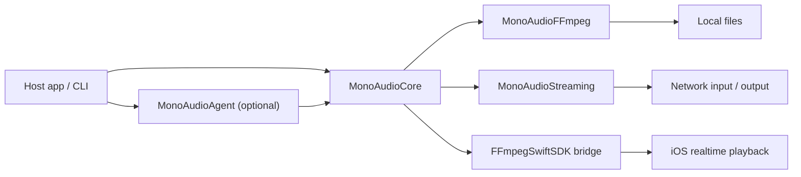

<p align="center">
  <picture>
    <source media="(prefers-color-scheme: dark)" srcset="assets/mono-audio-lockup-dark.svg">
    
  </picture>
</p>

<p align="center">
  <a href="README.zh-CN.md">简体中文</a> · <strong>English</strong>
</p>

<p align="center">
  
  
  
  
</p>

MonoAudio is a Swift package for audio tuning and streaming. Its versioned JSON
format covers device calibration, graphic and parametric EQ, compression, stereo
width, preamp, and limiting. The package validates plans, compiles FFmpeg filters,
processes files and streams, and provides an iOS `FFmpegSwiftSDK` adapter.

`MonoAudioAgent` is optional. It overwrites the provider's `deviceBaseline` with
the request value and validates the plan before returning it.

## Features

| Area | Implementation |
| --- | --- |
| Plan format | Versioned `MonoAudioPlan`, JSON Schema, 10- and 32-band graphic EQ |
| Parametric EQ | Peak, low-shelf, and high-shelf filters; up to 12 bands |
| Dynamics / stereo | One compressor stage and stereo width from `0.75` to `1.5` |
| Headroom / limiter | Combined device and tuning gain calculation, limiter and range checks |
| Agent | `MonoAudioAgentProvider`, device-baseline override, validation, and stale-request checks |
| FFmpeg | Filtergraph compilation, `ffprobe`, file rendering, capability inspection, and stream relay |
| iOS | `FFmpegSwiftSDKPlanExecutor` and `FFmpegSwiftSDKStreamingTransport` |
| CLI | Validate plans, inspect filtergraphs, probe inputs, render files, inspect capabilities, and preview or execute relay configurations |

The package does not include a player UI or codec binaries. Applications provide
playback state, network policy, caching, audio-session, and route handling.

## Signal path

```text
device baseline -> graphic EQ -> selective PEQ -> compressor -> stereo -> preamp -> final limiter
```

`deviceBaseline` stores calibration for the current output route. `graphicEQ` and
`parametricEQ` store the requested tuning. `MonoAudioPlanValidator` calculates
headroom from every enabled gain stage.



Render callbacks must not perform inference, JSON parsing, file I/O, or process
creation. Realtime backends precompile parameters and smooth live changes.

## Products

| Product | Responsibility |
| --- | --- |
| `MonoAudioCore` | `MonoAudioPlan`, `MonoAudioPlanValidator`, feature, route, and executor protocols |
| `MonoAudioAgent` | `MonoAudioAgentProvider`, stale-request checks, and plan validation |
| `MonoAudioFFmpeg` | `FFmpegFilterGraphCompiler`, `ffprobe`, render, capability, and relay APIs |
| `MonoAudioStreaming` | `MonoAudioStreamSource`, `MonoAudioStreamingTransport`, and `MonoAudioStreamingSession` |
| `mono-audio` | JSON-facing command-line entry point |

The root package imports neither UIKit nor AVFoundation. Only
`Integrations/FFmpegSwiftSDK` depends on the Apple binary framework.

## Requirements and installation

- Swift 6.0 or newer
- iOS 16+ / macOS 13+
- Swift 6 on Linux; Ubuntu CI is configured, while the checked-in local verification record is from macOS
- Executable `ffmpeg` and `ffprobe` binaries for probing, rendering, or streaming

Until the repository has a versioned release, add it as a local Swift package:

```swift
dependencies: [
    .package(path: "../MonoAudio")
]

// Link only the products your application uses.
.target(
    name: "YourApp",
    dependencies: [
        .product(name: "MonoAudioCore", package: "MonoAudio"),
        .product(name: "MonoAudioAgent", package: "MonoAudio"),
        .product(name: "MonoAudioStreaming", package: "MonoAudio"),
        .product(name: "MonoAudioFFmpeg", package: "MonoAudio")
    ]
)
```

## Quick start

```bash
swift test

# Invalid plans return a non-zero exit status.
swift run mono-audio validate Examples/neutral-plan.json

# Print the exact audio filtergraph passed to FFmpeg.
swift run mono-audio filtergraph Examples/neutral-plan.json

# Probe and process a local file.
swift run mono-audio probe input.flac
swift run mono-audio render \
  Examples/neutral-plan.json input.flac output.flac --overwrite

# Inspect this exact FFmpeg binary before choosing a stream protocol.
swift run mono-audio stream-capabilities

# Build relay argv without opening either endpoint.
swift run mono-audio relay-argv \
  Examples/http-hls-relay.json --check-capabilities
```

Call `MonoAudioAgent.tune(_:)`, then pass the validated plan to an executor:

```swift
import MonoAudioAgent
import MonoAudioCore

let agent = MonoAudioAgent(provider: provider)
let result = try await agent.tune(request)
try await executor.apply(result.plan)
```

`MonoAudioAgentProvider` may use an on-device model or a remote service.
`MonoAudioAgent` restores the request's device baseline, checks the requested band
mode, and runs `MonoAudioPlanValidator`.

## Agent Skill

| Name | Path |
| --- | --- |
| `$mono-audio-tuning` | [`.agents/skills/mono-audio-tuning`](.agents/skills/mono-audio-tuning/SKILL.md) |

Invocation:

```text
Use $mono-audio-tuning to validate Examples/neutral-plan.json and its relay configuration.
```

Tools that support `.agents/skills` can load it from the repository. To install
it in a personal Codex directory:

```bash
install_root="${CODEX_HOME:-$HOME/.codex}/skills"
mkdir -p "$install_root"
cp -R .agents/skills/mono-audio-tuning \
  "$install_root/"
```

Local verification:

```bash
bash .agents/skills/mono-audio-tuning/scripts/verify.sh
```

## Streaming

`MonoAudioStreaming` provides stream source types, request options, events, and a
session state machine. `MonoAudioStreamingSession` calls `open`, `play`, `pause`,
and `stop` on an injected `MonoAudioStreamingTransport`. The module does not
implement networking or decoding.

For relays, `FFmpegStreamingCommandBuilder` validates the configuration and
returns an executable plus argument array. The CLI exposes these operations:

```bash
# Protocol, demuxer, muxer, and audio-encoder evidence from the selected executable.
swift run mono-audio stream-capabilities [ffmpeg-executable]

# Preview argv only. This does not connect to the source or destination.
swift run mono-audio relay-argv relay.json --check-capabilities

# Start FFmpeg and wait for it to exit.
swift run mono-audio relay relay.json --check-capabilities
```

[`Examples/http-hls-relay.json`](Examples/http-hls-relay.json) contains no
credentials. Its source and destination use `example.com` and must be replaced
before running `relay`. `maximumDurationSeconds` maps to FFmpeg's `-t` option.
The current relay API waits for process completion and has no cancel or terminate
handle.

The example leaves `tuningPlan` as `null`. A relay configuration may embed a complete `MonoAudioPlan`; when it does, the audio codec must re-encode because `streamCopy` cannot run a filtergraph.

The protocol model includes HTTP, HTTPS, HLS, RTSP, RTMP, SRT, and Icecast.
Availability depends on the selected FFmpeg executable. `--check-capabilities`
checks its protocols, demuxers, muxers, and encoders; it does not test remote
reachability or filter availability.

MonoAudio does not implement reconnection policy, token refresh, adaptive bitrate,
caching, or UI. Request headers become FFmpeg arguments. If they contain
credentials, treat `relay-argv` output and `FFmpegExecutionResult.argv` as
sensitive; MonoAudio does not redact them.

## FFmpeg

The default graph uses stock FFmpeg filters:

```text
equalizer  bass  treble  acompressor  extrastereo  volume  alimiter
```

Offline renders and stream jobs launch FFmpeg with an argument array. Input paths, URLs, and filter expressions are never handed to a shell. Custom `ffmpeg` and `ffprobe` locations can be supplied through the public initializers.

The checked-in file-render fixture was run with FFmpeg 8.0.1.
`stream-capabilities` queries the selected FFmpeg executable. Applications that
distribute FFmpeg must review the licenses of that build, its codecs, and linked
libraries.

## iOS and FFmpegSwiftSDK

iOS does not spawn command-line FFmpeg. `Integrations/FFmpegSwiftSDK` defines
`FFmpegSwiftSDKPlanExecutor` and `FFmpegSwiftSDKStreamingTransport`:

```swift
import MonoAudioFFmpegSwiftSDK
import MonoAudioStreaming

let executor = FFmpegSwiftSDKPlanExecutor(player: player)
try await executor.apply(plan)

let transport = FFmpegSwiftSDKStreamingTransport(player: player)
let session = MonoAudioStreamingSession(transport: transport)
try await session.open(source)
try await session.play()
```

The streaming transport prepares with `autoPlay: false`, forwards the player's
previous delegate, and reports EOF, errors, and audio-format changes as transport
events. Unsupported request fields throw `unsupportedRequestOptions`.

`FFmpegSwiftSDK` handles demuxing, decoding, and realtime filters. The host
application manages the AVFoundation/Core Audio session and output route. The
Apple binary framework is referenced only by the integration package.

## Platform status

| Platform | Code in this repository | Verification status |
| --- | --- | --- |
| iOS 16+ | Core, Agent, stream session API, and `FFmpegSwiftSDK` plan/streaming adapters | Generic iOS Simulator bridge build recorded in `docs/VERIFICATION.md`; command-line FFmpeg is not used |
| macOS 13+ | All Swift products, CLI, file processing, capability inspection, and relay | Package tests, file rendering, and a loopback-only HLS relay fixture are recorded |
| Linux | Portable products and the macOS/Linux command-line code path; Ubuntu CI workflow is configured | Not part of the checked-in local verification record |
| Android | No runtime adapter yet | Planned: Kotlin facade and Oboe / AAudio executor |
| Windows | No runtime adapter yet | Planned: native executor |
| Web | No runtime adapter yet | Planned: AudioWorklet / WASM executor |

## Repository layout

```text
MonoAudio/
├── .agents/skills/mono-audio-tuning/
├── Sources/
│   ├── MonoAudioCore/
│   ├── MonoAudioAgent/
│   ├── MonoAudioFFmpeg/
│   ├── MonoAudioStreaming/
│   └── MonoAudioCLI/
├── Integrations/FFmpegSwiftSDK/
├── assets/
├── Schemas/
├── Examples/
├── Tests/
└── docs/
```

Read [`docs/ARCHITECTURE.md`](docs/ARCHITECTURE.md) for the module boundaries, [`docs/STREAMING.md`](docs/STREAMING.md) for stream integration, [`docs/FFMPEG.md`](docs/FFMPEG.md) for backend details, and [`docs/VERIFICATION.md`](docs/VERIFICATION.md) for reproducible test records.

## Roadmap

- [x] Versioned tuning contract and JSON Schema
- [x] Local validation, curve-smoothing checks, and multi-stage headroom calculation
- [x] FFmpeg filtergraph compilation, probing, and offline rendering
- [x] Stream-source models, session state machine, and FFmpeg capability/relay backend
- [x] iOS `FFmpegSwiftSDK` plan executor and streaming transport
- [x] `.agents/skills/mono-audio-tuning`
- [ ] Cross-language conformance fixtures
- [ ] Android realtime executor
- [ ] Native macOS, Windows, and Linux realtime executors
- [ ] Web AudioWorklet / WASM executor

New backends must pass the shared plan and validator fixtures.

## Contributing

Issues are welcome in English or Chinese. For changes to the public API, JSON fields, or DSP order, describe the host use case and compatibility impact first. Pull requests should include tests and run:

```bash
swift test
```

Schema changes must update the example plans, validator, and documentation
together. Realtime changes should account for threading, allocation, parameter
smoothing, and recovery. If a pull request claims audible improvement, include
measurements or name the listening equipment and method.

## License

MonoAudio source is available under the [MIT License](LICENSE). FFmpeg, measurement data, and other third-party components keep their own licenses; MonoAudio's MIT license does not alter their distribution terms.
