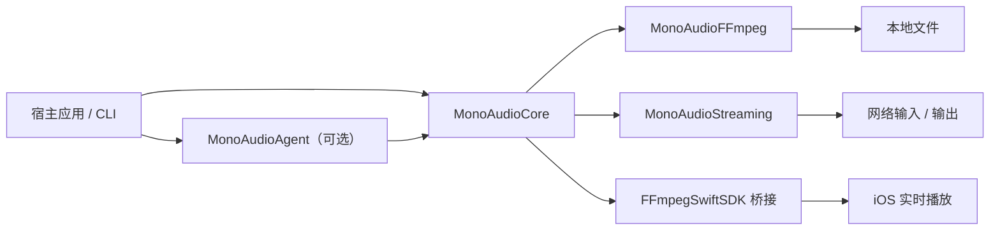

<p align="center">
  <picture>
    <source media="(prefers-color-scheme: dark)" srcset="assets/mono-audio-lockup-dark.svg">
    
  </picture>
</p>

<p align="center">
  <strong>简体中文</strong> · <a href="README.md">English</a>
</p>

<p align="center">
  
  
  
  
</p>

MonoAudio 是一个用于音频调校与流媒体的 Swift Package。带版本的 JSON 格式
包含设备校准、图形与参数均衡、压缩、立体声宽度、前级和限幅参数。项目提供方案
校验、FFmpeg 滤镜编译、文件与流处理，以及 iOS `FFmpegSwiftSDK` 适配器。

`MonoAudioAgent` 是可选模块。它会用请求中的值覆盖提供方返回的
`deviceBaseline`，并在返回方案前完成本地校验。

## 功能

| 能力 | 当前实现 |
| --- | --- |
| 方案格式 | 带版本的 `MonoAudioPlan`、JSON Schema、10/32 段图形均衡 |
| 参数均衡 | 峰值、低架与高架滤镜，最多 12 段 |
| 动态 / 立体声 | 单级压缩，立体声宽度范围为 `0.75` 至 `1.5` |
| 余量 / 限幅 | 合并设备与调音增益，检查限幅器和参数范围 |
| Agent | `MonoAudioAgentProvider`、设备基线覆盖、方案校验与过期请求检查 |
| FFmpeg | 滤镜链编译、`ffprobe`、文件渲染、能力检测与流转发 |
| iOS | `FFmpegSwiftSDKPlanExecutor` 与 `FFmpegSwiftSDKStreamingTransport` |
| 命令行 | 校验方案、查看滤镜链、探测输入、渲染文件、检查能力、预览或执行 relay 配置 |

项目不包含播放器界面或编解码器二进制。播放状态、网络策略、缓存、音频会话和
输出设备切换由接入方实现。

## 处理链

```text
设备校准 -> 图形 EQ -> 选择性 PEQ -> 压缩 -> 立体声处理 -> 前级 -> 最终限幅
```

`deviceBaseline` 保存当前输出设备的校准曲线，`graphicEQ` 和
`parametricEQ` 保存本次调音参数。`MonoAudioPlanValidator` 按所有已启用的增益
阶段计算前级余量。



实时回调不得执行模型推理、JSON 解析、文件 I/O 或进程创建。平台后端需要预编译
参数，并对播放中的参数变化做平滑处理。

## 模块

| Product | 职责 |
| --- | --- |
| `MonoAudioCore` | `MonoAudioPlan`、`MonoAudioPlanValidator`、特征、路由与执行器协议 |
| `MonoAudioAgent` | `MonoAudioAgentProvider`、过期请求检查与方案校验 |
| `MonoAudioFFmpeg` | `FFmpegFilterGraphCompiler`、`ffprobe`、渲染、能力与 relay API |
| `MonoAudioStreaming` | `MonoAudioStreamSource`、`MonoAudioStreamingTransport` 与 `MonoAudioStreamingSession` |
| `mono-audio` | 接收 JSON 的命令行入口 |

根包不依赖 UIKit 或 AVFoundation。只有 `Integrations/FFmpegSwiftSDK`
依赖 Apple 二进制框架。

## 环境

- Swift 6.0 或更高版本
- iOS 16+ / macOS 13+
- Linux 需要 Swift 6；仓库配置了 Ubuntu CI，当前本地验证记录来自 macOS
- 使用探测、渲染或流媒体功能时，需要可执行的 `ffmpeg` 与 `ffprobe`

仓库尚未发布版本标签时，可以先作为本地 Swift Package 接入：

```swift
dependencies: [
    .package(path: "../MonoAudio")
]

// 按需选择，不必把所有模块一起链接进应用。
.target(
    name: "YourApp",
    dependencies: [
        .product(name: "MonoAudioCore", package: "MonoAudio"),
        .product(name: "MonoAudioAgent", package: "MonoAudio"),
        .product(name: "MonoAudioStreaming", package: "MonoAudio"),
        .product(name: "MonoAudioFFmpeg", package: "MonoAudio")
    ]
)
```

## 快速开始

```bash
swift test

# 检查一份方案；无效方案返回非零状态码
swift run mono-audio validate Examples/neutral-plan.json

# 查看将交给 FFmpeg 的滤镜链
swift run mono-audio filtergraph Examples/neutral-plan.json

# 探测并处理本地音频
swift run mono-audio probe input.flac
swift run mono-audio render \
  Examples/neutral-plan.json input.flac output.flac --overwrite

# 先读取当前这份 FFmpeg 的流媒体能力
swift run mono-audio stream-capabilities

# 只生成 relay 参数，不连接输入和输出
swift run mono-audio relay-argv \
  Examples/http-hls-relay.json --check-capabilities
```

调用 `MonoAudioAgent.tune(_:)`，再把通过校验的方案交给执行器：

```swift
import MonoAudioAgent
import MonoAudioCore

let agent = MonoAudioAgent(provider: provider)
let result = try await agent.tune(request)
try await executor.apply(result.plan)
```

`MonoAudioAgentProvider` 可以使用本地模型或远端服务。`MonoAudioAgent` 会恢复
请求中的设备基线、检查频段模式，并运行 `MonoAudioPlanValidator`。

## Agent Skill

| 名称 | 路径 |
| --- | --- |
| `$mono-audio-tuning` | [`.agents/skills/mono-audio-tuning`](.agents/skills/mono-audio-tuning/SKILL.md) |

调用格式：

```text
使用 $mono-audio-tuning 校验 Examples/neutral-plan.json 和 relay 配置。
```

支持 `.agents/skills` 的工具可以直接读取。安装到 Codex 个人目录：

```bash
install_root="${CODEX_HOME:-$HOME/.codex}/skills"
mkdir -p "$install_root"
cp -R .agents/skills/mono-audio-tuning \
  "$install_root/"
```

本地验证：

```bash
bash .agents/skills/mono-audio-tuning/scripts/verify.sh
```

## 流媒体

`MonoAudioStreaming` 提供流来源、请求选项、事件和会话状态机。
`MonoAudioStreamingSession` 调用注入的 `MonoAudioStreamingTransport` 完成
`open`、`play`、`pause` 和 `stop`。该模块不实现网络连接或解码。

转发配置由 `FFmpegStreamingCommandBuilder` 校验，输出可执行文件和参数数组。
CLI 提供以下命令：

```bash
# 从指定 FFmpeg 读取 protocol、demuxer、muxer 与音频 encoder
swift run mono-audio stream-capabilities [ffmpeg-executable]

# 只预览 argv，不发起网络连接
swift run mono-audio relay-argv relay.json --check-capabilities

# 启动 FFmpeg，并等待进程退出
swift run mono-audio relay relay.json --check-capabilities
```

[`Examples/http-hls-relay.json`](Examples/http-hls-relay.json) 不含凭据。输入和
输出地址使用 `example.com`，执行 `relay` 前需要替换。`maximumDurationSeconds`
对应 FFmpeg 的 `-t` 参数。当前 relay API 会等待进程结束，没有 cancel 或
terminate handle。

示例中的 `tuningPlan` 为 `null`。实际配置可以内嵌完整的 `MonoAudioPlan`；此时音频必须重新编码，因为 `streamCopy` 不能与滤镜链同时使用。

协议模型包含 HTTP、HTTPS、HLS、RTSP、RTMP、SRT 和 Icecast。实际可用能力
取决于所选 FFmpeg 可执行文件。`--check-capabilities` 检查 protocol、demuxer、
muxer 和 encoder，但不测试远端地址或滤镜可用性。

MonoAudio 不实现断线重连策略、鉴权刷新、ABR、缓存或 UI。请求头会进入 FFmpeg
参数；如果其中带有凭据，应把 `relay-argv` 输出和
`FFmpegExecutionResult.argv` 当作敏感信息处理。MonoAudio 当前不会自动脱敏。

## FFmpeg

默认滤镜链使用 FFmpeg 自带的以下滤镜：

```text
equalizer  bass  treble  acompressor  extrastereo  volume  alimiter
```

离线渲染和流任务都以参数数组启动 FFmpeg；输入路径、URL 和滤镜表达式不会交给 shell 求值。可通过构造函数指定自定义的 `ffmpeg` / `ffprobe` 路径。

仓库中的文件渲染记录使用 FFmpeg 8.0.1。`stream-capabilities` 从所选 FFmpeg
可执行文件读取能力。分发 FFmpeg 时需要检查该构建、编码器和链接库的许可证。

## iOS 与 FFmpegSwiftSDK

iOS 不会启动命令行 FFmpeg。`Integrations/FFmpegSwiftSDK` 定义
`FFmpegSwiftSDKPlanExecutor` 和 `FFmpegSwiftSDKStreamingTransport`：

```swift
import MonoAudioFFmpegSwiftSDK
import MonoAudioStreaming

let executor = FFmpegSwiftSDKPlanExecutor(player: player)
try await executor.apply(plan)

let transport = FFmpegSwiftSDKStreamingTransport(player: player)
let session = MonoAudioStreamingSession(transport: transport)
try await session.open(source)
try await session.play()
```

流媒体适配器使用 `autoPlay: false`，转发播放器原有 delegate，并把自然结束、
错误与音频格式变化映射成 transport event。不支持的请求字段会抛出
`unsupportedRequestOptions`。

`FFmpegSwiftSDK` 处理解封装、解码和实时滤镜。宿主应用管理 AVFoundation /
Core Audio 会话与输出路由。Apple 二进制框架只由集成包引用。

## 平台状态

| 平台 | 当前仓库中的代码 | 验证状态 |
| --- | --- | --- |
| iOS 16+ | Core、Agent、流会话 API 与 `FFmpegSwiftSDK` 方案/流媒体适配器 | `docs/VERIFICATION.md` 记录了通用 iOS Simulator 桥接构建；不使用命令行 FFmpeg |
| macOS 13+ | 全部 Swift products、CLI、文件处理、能力检测与 relay | 已记录包测试、文件渲染和仅走本机回环地址的 HLS relay |
| Linux | 可移植 products 与 macOS/Linux 命令行代码路径；已配置 Ubuntu CI | 不在当前落盘的本机验证记录中 |
| Android | 尚无运行时适配器 | 计划提供 Kotlin 接口与 Oboe / AAudio 执行器 |
| Windows | 尚无运行时适配器 | 计划提供原生执行器 |
| Web | 尚无运行时适配器 | 计划提供 AudioWorklet / WASM 执行器 |

## 目录

```text
MonoAudio/
├── .agents/skills/mono-audio-tuning/
├── Sources/
│   ├── MonoAudioCore/
│   ├── MonoAudioAgent/
│   ├── MonoAudioFFmpeg/
│   ├── MonoAudioStreaming/
│   └── MonoAudioCLI/
├── Integrations/FFmpegSwiftSDK/
├── assets/
├── Schemas/
├── Examples/
├── Tests/
└── docs/
```

设计边界见 [`docs/ARCHITECTURE.md`](docs/ARCHITECTURE.md)，流媒体接入见 [`docs/STREAMING.md`](docs/STREAMING.md)，FFmpeg 说明见 [`docs/FFMPEG.md`](docs/FFMPEG.md)，可复现实验记录见 [`docs/VERIFICATION.md`](docs/VERIFICATION.md)。

## 路线图

- [x] 带版本的调音协议与 JSON Schema
- [x] 本地校验、曲线平滑检查与多阶段余量计算
- [x] FFmpeg 滤镜编译、探测与离线渲染
- [x] 流来源模型、会话状态机与 FFmpeg 能力检测 / relay 后端
- [x] iOS `FFmpegSwiftSDK` 方案执行器与流媒体 transport
- [x] `.agents/skills/mono-audio-tuning`
- [ ] 跨语言一致性测试夹具
- [ ] Android 实时执行器
- [ ] macOS / Windows / Linux 原生实时执行器
- [ ] Web AudioWorklet / WASM 执行器

新的平台后端需要通过共用的方案与校验夹具。

## 参与开发

Issue 可以使用中文或英文。涉及公共 API、JSON 字段或 DSP 顺序的改动，建议先说明宿主场景和兼容策略；提交代码时请同时补充测试，并运行：

```bash
swift test
```

如果改动 Schema，请同步更新示例、校验器和文档。若改动实时链路，请说明线程、
内存分配、参数平滑和异常恢复方式。若 PR 声称改善音质，请附测量数据，或注明试听
设备与测试方法。

## 许可证

MonoAudio 源码使用 [MIT License](LICENSE)。FFmpeg、设备测量数据和其他第三方组件继续适用各自的许可证；本项目的 MIT 许可不会改变它们的分发条件。
