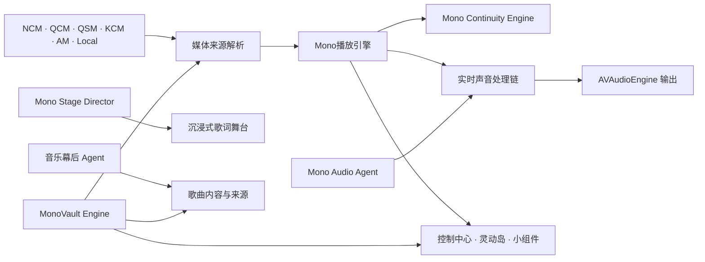

<p align="center">
  
</p>

<h1 align="center">Mono</h1>

<p align="center">
  <strong>不只是播放音乐，而是重新组织声音、内容与界面。</strong>
</p>

<p align="center">
  一款面向 iPhone 的多平台原生音乐播放器，由自研播放、连续播放、智能调音、舞台编排与数据引擎共同驱动。
</p>

<p align="center">
  
  
  
  
  
</p>

<p align="center">
  <a href="#核心引擎">核心引擎</a> ·
  <a href="#主要能力">主要能力</a> ·
  <a href="#系统架构">系统架构</a> ·
  <a href="#开始使用源码">开始使用源码</a> ·
  <a href="#项目结构">项目结构</a>
</p>

---

## Mono 是什么

Mono 是一套围绕真实音乐播放场景构建的 iOS 音频应用。它统一接入 NCM、QCM、QSM、KCM、Apple Music 与本地音乐，同时把取址、解码、播放队列、无缝切歌、后台恢复、系统媒体信息、歌词、音效与个性化界面收进一套完整链路。

项目没有把系统播放器简单包一层。网络媒体主要由 FFmpeg 8 解封装与解码，声音通过 AVAudioEngine 输出；Apple Music 受保护内容则由 MusicKit 的系统播放通道承接。播放器界面、控制中心、灵动岛、小组件与播放队列都以“真正开始出声”的播放事务为准。

## 核心引擎

<table>
  <tr>
    <td width="50%" valign="top">
      <h3>Mono播放引擎</h3>
      <p><strong>FFmpeg 8 + AVAudioEngine 深度定制</strong></p>
      <p>负责媒体取址、格式探测、解封装、解码、缓冲、输出、Seek、音频会话、后台续播与系统媒体状态。播放地址过期、蓝牙中断、音频路由变化和冷启动恢复都在同一播放事务中处理。</p>
    </td>
    <td width="50%" valign="top">
      <h3>Mono Continuity Engine</h3>
      <p><strong>连续播放与无缝切歌引擎</strong></p>
      <p>通过“提前取址 + 临近曲尾预装解码管线”的两阶段策略准备下一首。它同时维护会话身份、队列快照和过期任务取消，避免界面先切歌、旧回调抢占或同一首被重复播放。</p>
    </td>
  </tr>
  <tr>
    <td width="50%" valign="top">
      <h3>Mono Audio Agent</h3>
      <p><strong>首创自研智能调音 Agent</strong></p>
      <p>从音效处理前的原始音频采样，分析频谱、响度、动态、节奏、BPM、调性、旋律、人声与乐器线索，再结合输出设备生成 10 段或 32 段均衡、音色、空间、动态与校准方案。结果可按歌曲和设备保存、复用、重做与对比。</p>
    </td>
    <td width="50%" valign="top">
      <h3>Mono Stage Director</h3>
      <p><strong>沉浸式歌词舞台编排引擎</strong></p>
      <p>按歌曲段落生成可复用的舞台脚本，把主歌、副歌、间奏与能量变化映射为歌词层级、镜头、光影、景深和节奏提示；脚本按歌曲缓存，播放过程中只执行轻量时间线。</p>
    </td>
  </tr>
  <tr>
    <td width="50%" valign="top">
      <h3>MonoVault Engine</h3>
      <p><strong>统一数据与缓存治理引擎</strong></p>
      <p>在 SwiftData 与 Core Data 之上统一歌曲、歌单、歌词、播放历史、下载与本地歌单的数据入口，合并高频写入并执行容量维护。可再生缓存可以清理，用户下载和本地歌单不会被自动裁剪。</p>
    </td>
    <td width="50%" valign="top">
      <h3>Mono Sound Pipeline</h3>
      <p><strong>实时声音处理链</strong></p>
      <p>提供 10/32 段图示均衡、参数均衡、动态 EQ、多段动态、低高音、混响、环绕、Haas 空间处理、输出校准、耳机校正、前级余量和最终限幅。参数集中提交，减少播放中反复重建处理链造成的卡音。</p>
    </td>
  </tr>
</table>

## 主要能力

### 多平台音乐

| 来源 | 接入范围 |
|---|---|
| NCM | 搜索、推荐、歌单、榜单、歌手、专辑、MV、评论、歌词与播放 |
| QCM | 搜索、推荐、歌单、榜单、歌手、专辑、MV、评论、歌词与多档音质 |
| QSM | 歌曲检索、播放、歌词与音质选择 |
| KCM | 搜索、推荐、歌单广场、榜单、个人歌单、MV、评论、歌词与多档音质 |
| Apple Music | 目录搜索、资料库、歌手、专辑、歌单与 MusicKit 播放 |
| Local | 文件导入、本地歌单、元数据、封面、歌词与离线播放 |

每条歌曲、歌单、专辑、歌手、MV 与评论请求都携带平台身份。相同数字 ID 不会跨平台复用缓存、封面、歌词或播放记录。

### 歌词与音乐幕后

- 多歌词源选择，支持全局跟随歌曲来源和单曲手动切换。
- 逐字歌词、翻译、独立动画效果、自定义字体与沉浸式横屏舞台。
- 「音乐幕后」接入内容 Agent，整理歌曲简介、创作故事、发行背景、专辑内容和参考来源。
- 歌曲内容按平台与录音版本独立缓存，避免同名歌曲或不同版本串用资料。

### 声音中心

- 10 段与可选 32 段均衡器，以及分别调校的内置预设。
- 标准调音与 Mono 空间增强两套独立方案。
- 智能、快速、深度与自定义采样；轻柔、标准、强烈与智能调音强度。
- 输出设备校准、耳机校正、专业动态处理与自定义预设云端恢复。
- 调音结果自动应用，也可以关闭、重新分析、删除或切换历史方案。

### 界面与系统体验

- 多套全局主题、播放器主题、图标包、深浅色配色与自定义字体。
- 沉浸式歌词、视频背景、GPU 舞台、手势切歌与音量控制。
- 黑胶、漫画等多尺寸桌面小组件，以及控制中心、锁屏、灵动岛和 Live Activity 同步。
- 播放队列、听歌统计、日报/周报、下载管理、云端同步与一起听。

## 系统架构



代码采用 SwiftUI + Combine + async/await，并按播放、网络、模型、业务管理、主题和界面分层。播放核心以 `PlayerManager` 作为 facade，具体职责由音频会话、取址、连续播放、系统媒体同步、持久化和缓存治理子系统分别承担。

## 技术栈

| 层级 | 技术 |
|---|---|
| UI | SwiftUI、WidgetKit、ActivityKit、AppIntents |
| 音频 | FFmpeg 8、AVAudioEngine、AVFoundation、MediaPlayer |
| Apple Music | MusicKit、ApplicationMusicPlayer |
| 并发 | Swift Concurrency、Combine |
| 数据 | SwiftData、Core Data、Keychain、文件缓存 |
| 网络 | URLSession、多线路健康探测与故障切换 |
| 工程 | Swift Package Manager、Xcode File System Synchronized Groups |

## 开始使用源码

### 环境要求

- macOS 与可运行 Swift 6.2 的 Xcode
- iOS 16 或更高版本
- 对应音乐服务的自建后端与授权信息
- 使用 Apple Music 时，需要在开发者后台启用 MusicKit 能力

### 1. 克隆仓库

```bash
git clone https://github.com/Lincb522/Mono.git
cd Mono
```

### 2. 创建本地配置

```bash
cp Secrets.xcconfig.example Secrets.xcconfig
```

根据你的部署填写主线路与备用线路。`Secrets.xcconfig` 包含服务地址、应用令牌和本地开发凭据，不应提交到 Git。

### 3. 打开工程

```bash
open Mono.xcodeproj
```

在 Xcode 中为 Debug 与 Release 选择 `Secrets.xcconfig`，确认 Signing、App Group、MusicKit 与 Widget Extension 使用你自己的开发者配置，然后运行 `Mono` Scheme。

## 项目结构

```text
Mono/
├── Sources/Mono/              # iOS App 主源码与资源
│   ├── App/                   # App 入口与全局生命周期
│   ├── Playback/              # Mono播放引擎及播放子系统
│   ├── Managers/              # AI、音频、缓存、云端和业务管理
│   ├── Network/               # 平台 API、媒体服务与安全策略
│   ├── Database/              # MonoVault Engine 与数据仓库
│   ├── Models/                # 跨平台领域模型
│   ├── Themes/                # 全局主题与渲染基础设施
│   ├── Views/                 # SwiftUI 页面与组件
│   └── Resources/             # 本地化、字体、预设与资产
├── Packages/
│   ├── Audio/                 # FFmpegSwiftSDK
│   ├── MusicServices/         # NCM / QCM 客户端包
│   └── Icons/                 # 独立图标包
├── music/                     # Widget Extension 与小组件主题
├── Shared/                    # App / Widget 共享 Intent 与模型
├── Services/Server/           # 自建服务、配置分发与内容服务
├── Scripts/                   # 构建、资源和维护脚本
├── DesignAssets/              # 品牌与图标源文件
└── docs/                      # 产品、架构与实现文档
```

## 开源项目致谢

Mono 的实现离不开以下项目与社区工作：

| 项目 | 用途 |
|---|---|
| [FFmpeg](https://ffmpeg.org/) | 音频解封装、解码、重采样与滤镜基础 |
| [NeteaseCloudMusicApi Enhanced](https://github.com/NeteaseCloudMusicApiEnhanced/api-enhanced) | NCM 服务基础 |
| [QQMusicApi](https://github.com/L-1124/QQMusicApi) | QCM 服务基础 |
| [KuGouMusicApi](https://github.com/MakcRe/KuGouMusicApi) | KCM 服务基础 |
| [ZIPFoundation](https://github.com/weichsel/ZIPFoundation) | 字体压缩包导入 |

## 免责声明

> Mono 仅用于学习、研究与个人开发测试。仓库不提供音乐文件，也不拥有第三方平台内容的版权。使用者应遵守所在地法律、平台服务条款与音乐版权要求，并自行承担部署和使用产生的责任。

---

<p align="center">
  <strong>Mono</strong><br />
  把每一次播放，交给一套完整的声音系统。
</p>
