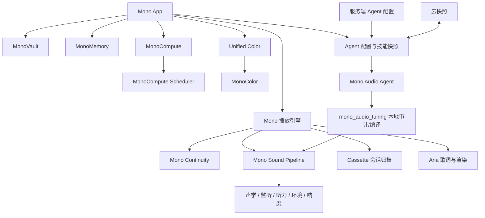

# Mono 引擎总览

> 更新日期：2026-08-22
> 本文只记录当前仓库中已经存在的实现，不把规划、实验构想或已删除功能写成已上线能力。

Mono 的“引擎”不是单一巨型模块，而是按播放、数据、资源治理、颜色、声音中心、歌词渲染、内容服务和基础包分层。业务页面只消费公开状态和动作；实时音频、持久化、图像分析与后台维护分别由对应引擎负责。

## 1. 核心播放与会话

### Mono 播放引擎

- **实现入口**：`Sources/Mono/Playback/Engine/MonoPlaybackEngine.swift`
- **当前类型**：`PlayerManager` 是播放 facade；底层使用 `FFmpegSwiftSDK.StreamPlayer`，Apple Music 受保护内容走 `AppleMusicPlaybackCoordinator`。
- **职责**：统一当前歌曲、队列、播放模式、进度、音质、音频会话、锁屏信息、小组件同步、睡眠定时与平台媒体取址。
- **边界**：页面不直接装配 FFmpeg 管线；平台 API 不直接提交播放器展示状态。

### Mono Continuity Engine

- **实现**：`Sources/Mono/Playback/Engine/GaplessEngine.swift`
- **类型**：`MonoContinuityEngine`
- **职责**：阶段 A 预取真实播放地址，阶段 B 在临近结尾时创建新鲜解码管线并预解码；处理队列或模式变化后的失效、事务去重、自然结束对账和单曲循环。
- **当前规则**：只有目标歌曲真正进入可听管线后才提交界面和队列状态；旧任务和旧回调不能覆盖当前事务。

### Cassette 播放会话归档

- **实现**：`Sources/Mono/Playback/State/PlaybackSessionArchive.swift`
- **类型**：`PlaybackSessionArchive`
- **职责**：保存完整队列双快照与独立播放位置日志；写入带版本、序号、长度和校验值，主快照损坏时可回退上一份有效快照。
- **持久化**：位于 Application Support 的 `MonoPlaybackSession` 目录，使用原子写入和文件保护。

### SongMirror 跨平台身份引擎

- **实现**：`Sources/Mono/Managers/Library/MonoMediaIdentityEngine.swift`
- **类型**：`MonoMediaIdentityEngine`
- **职责**：把外部歌单元数据匹配到 Mono 已接入平台的真实歌曲。
- **匹配依据**：已保存映射、ISRC、歌名、歌手、版本标记、专辑、时长和平台优先级。
- **持久化**：高置信匹配会保存，后续导入优先复用；低置信或相近候选不会自动固化。

## 2. 数据与缓存治理

### MonoVault Engine

- **实现**：`Sources/Mono/Database/MonoDatabaseEngine.swift`
- **类型**：`MonoVaultEngine`；保留 `MonoDatabaseEngine` 兼容别名。
- **职责**：在 `MonoStore` 之上统一批量写入、350 ms 延迟合并保存、健康检查、每日维护和可再生缓存裁剪。
- **保护范围**：自动维护不会删除下载文件或用户创建的本地歌单。
- **当前上限**：歌曲缓存超过 2,000 条时按使用情况整理；播放历史超过 20,000 条时保留最新记录；不同缓存类型使用独立过期时间。

### MonoMemory Engine

- **实现**：`Sources/Mono/Managers/Memory/MonoMemoryEngine.swift`
- **详细文档**：[mono-memory-engine.md](mono-memory-engine.md)
- **职责**：按照设备内存、前后台、低电量、热状态和系统压力统一分配缓存预算，并按 `routine`、`background`、`warning`、`critical` 四级回收可重建资源。
- **当前接入**：封面、URLSession 响应、编码数据、歌曲与歌单模型、Apple Music 模型、本地歌单派生数据、播放地址、主题背景、视频缩略图、收音机栅格、听歌洞察和下一曲预取任务。
- **边界**：只治理内存资源，不删除数据库、下载、用户配置和磁盘持久化缓存。

## 3. CPU、GPU 与后台任务

### MonoCompute Engine

- **实现**：`Sources/Mono/Managers/System/MonoComputeEngine.swift`
- **详细文档**：[mono-compute-engine.md](mono-compute-engine.md)
- **职责**：根据进程 CPU、实时帧稳定性、热状态、低电量、录屏和前后台状态，统一输出交互帧率、连续动画帧率、重视觉帧率、GPU 渲染比例、粒子密度、Shader 准入与后台并发预算。
- **策略**：使用平滑、连续异常样本和迟滞恢复，避免短时波动让流体或歌词动画突然停滞。
- **边界**：不进入实时音频回调，不暂停歌曲，也不伪造系统 GPU 使用率。

### MonoCompute Scheduler

- **实现**：`Sources/Mono/Managers/System/MonoComputeScheduler.swift`
- **类型**：`MonoComputeScheduler`
- **职责**：作为 CPU 密集任务的 admission controller，按 `userInitiated`、`analysis`、`maintenance` 优先级和 FIFO 顺序限制并发。
- **取消规则**：等待中的任务可安全取消；已运行任务不因预算下降被强行中断。

## 4. 全局颜色与视觉分析

### MonoColor Engine

- **实现**：`Sources/Mono/Managers/Appearance/MonoColorEngine.swift`
- **类型**：`MonoColorEngine`
- **职责**：作为底层封面图像分析器，统一下载去重、任务复用、LRU 缓存、多区域采样、感知颜色聚类和 2～6 色调色板输出。
- **输出**：主色、次色、完整调色板、整体/顶部/歌词区域亮度，以及普通文字和歌词的可读前景色。

### Unified Color Engine

- **实现**：`Sources/Mono/Managers/Appearance/UnifiedColorEngine.swift`
- **类型**：`UnifiedColorEngine`
- **职责**：把主题品牌色与 `MonoColorEngine` 的封面颜色合成为全局语义颜色快照，并向播放器、歌词、背景、悬浮栏、锁屏和小组件提供统一入口。
- **当前作用范围**：封面色只影响允许动态染色的音乐环境表面。
- **结构色保护**：设置容器、首页固定白色区域、系统弹窗、Sheet、三点菜单和其他结构性材质继续使用主题原始 token，不受封面取色污染。
- **模式**：主题、智能融合和封面主导；智能/随机取色及 2～6 色数量设置直接驱动底层分析器。

### Native Subject Cutout Engine

- **实现**：`Sources/Mono/Views/Player/Components/Cover/NativeSubjectCutoutEngine.swift`
- **类型**：`NativeSubjectCutoutEngine`
- **职责**：使用系统 Vision 前景实例分割提取封面主体，为撕纸等播放器主题生成主体合成结果，并按封面身份缓存。

## 5. 声音中心引擎

### Mono Sound Pipeline

- **主要入口**：`Sources/Mono/Managers/Audio/EQManager.swift`、`Packages/Audio/ffmpeg-swift/Sources/FFmpegSwiftSDK`
- **职责**：统一提交图形 EQ、参数 EQ、动态 EQ、多段动态、音色、混响、空间、Haas、输出校准、耳机校正、前级余量和最终限幅。
- **规则**：业务层提交参数，不在每次界面刷新时重建音频处理链。

### Mono Acoustic Profile Engine

- **实现**：`Sources/Mono/Managers/Audio/MonoAcousticProfileEngine.swift`
- **职责**：下载、缓存和解析 OPRA 耳机声学数据库；提供搜索、收藏、最近使用、输出设备名称匹配，并将参数滤波器换算为当前 10/32 段模式的设备校正曲线。

### Mono Audio Monitor Engine

- **实现**：`Sources/Mono/Managers/Audio/MonoAudioMonitorEngine.swift`
- **职责**：读取处理前后频谱和 PCM，计算 RMS、Momentary/Short-term/Integrated LUFS、采样峰值、估算真峰值、相位相关、单声道兼容、立体声宽度和削波比例；同时输出当前 DSP 链快照与余量估算。

### Mono DSP History Engine

- **实现**：`Sources/Mono/Managers/Audio/MonoDSPHistoryEngine.swift`
- **职责**：为声音中心保存最多 20 份 DSP 快照，统一撤销/重做 EQ、动态处理、输出校准、耳机配置、听力补偿和环境曲线。

### Mono Hearing Profile Engine

- **实现**：`Sources/Mono/Managers/Audio/MonoHearingProfileEngine.swift`
- **职责**：经用户授权读取 HealthKit 最新听力图与近期耳机声暴露，以受限增益生成听力补偿曲线；补偿仍受前级余量和最终限幅保护。

### Mono Listening Environment Engine

- **实现**：`Sources/Mono/Managers/Audio/MonoListeningEnvironmentEngine.swift`
- **职责**：经麦克风授权执行短时环境采样，分析环境噪声底与频段能量，生成只做温和衰减、不在嘈杂频段增益的掩蔽建议，并持久化最近测量。

### Mono Loudness Engine

- **实现**：`Sources/Mono/Managers/Audio/MonoLoudnessEngine.swift`
- **职责**：按歌曲保存响度与峰值测量，支持歌曲/专辑归一化；增益由目标 LUFS 与真峰值余量共同约束，记录数量受控并持久化。

### Audio Repair Engine

- **实现**：`Packages/Audio/ffmpeg-swift/Sources/FFmpegSwiftSDK/Engine/AudioRepairEngine.swift`
- **职责**：位于音效处理之后、硬件输出之前，检测并修复异常音频输出；由播放器通过 `streamPlayer.audioRepair` 暴露。

## 6. 沉浸歌词与点阵渲染

### Aria Lyric Engine

- **实现**：`Sources/Mono/Views/Player/AriaStage/Lyrics/AriaLyricEngine.swift`
- **职责**：构建行、词和字素时间轴，合成缺失逐字时间，插入间奏，识别重复副歌，生成短句/微句渲染提示，并处理 CJK 分组与标点黏附。

### Aria Lyric Render Engine

- **实现**：`Sources/Mono/Views/Player/AriaStage/Lyrics/AriaLyricRenderEngine.swift`
- **职责**：统一歌词刷新调度和 GPU 合成策略；字形塑形、字体与辅助功能继续由 SwiftUI/CoreText 处理，只有需要遮罩或混合的效果进入 Metal 合成面。

### Aria Tension Engine

- **实现**：`Sources/Mono/Views/Player/AriaStage/Core/AriaTensionEngine.swift`
- **职责**：依据歌词副歌标记、重复句和段落结构计算张力窗口，为命中时刻的镜头脉冲和节拍触觉提供轻量几何信号，不创建额外时钟。

### Pixel Pattern / Delay Engine

- **实现**：
  - `Packages/UI/SwiftPixelGrid/Sources/SwiftPixelGrid/PixelPatternEngine.swift`
  - `Packages/UI/SwiftPixelGrid/Sources/SwiftPixelGrid/PixelDelayEngine.swift`
- **职责**：前者把时间映射为离散点阵帧，后者计算九像素独立延迟和连续亮度；两者不依赖 SwiftUI，可供 Canvas 和普通视图共同使用。

## 7. 平台与基础能力

### KCM Daily Membership Engine

- **实现**：`Sources/Mono/Managers/Settings/KCMDailyMembershipEngine.swift`
- **职责**：登录后按账号每天检查一次酷狗可领取会员权益；成功或“今日已领取”保存日期标记，失败不标记并允许下次前台重试。

### NCM Crypto Engine

- **实现**：`Packages/MusicServices/NeteaseCloudMusicAPI-Swift/Sources/NeteaseCloudMusicAPI/Crypto/CryptoEngine.swift`
- **职责**：封装 NCM API 请求所需的加密过程，属于音乐服务基础包，不参与 App 的 UI、播放队列或凭证持久化策略。

## 8. Agent 运行体系（相关但不归入本地 Engine 类型）

### 通用 Agent 配置面

- **运行策略**：`Sources/Mono/Managers/AI/AIAgentRuntimePolicy.swift`。
- **服务端配置**：`Services/Server/song-content/song-content-config.js` 统一下发模型、提示词、超时、生成选项以及 Mono Audio Agent 的 `skills` / `toolPolicy`；Agent 管理页可发布可选内置技能和自定义技能，但不能关闭必需安全契约。
- **客户端配置**：`AppAgentConfigurationStore` 按既有 TTL 缓存读取服务端 Agent 配置，并在返回配置前同步给 `MonoAudioAgentSkillStore`，避免 UI 与本次调音请求使用不同的技能快照。
- **当前 Agent**：Mono Audio Agent 与 Listening Insight Agent 共用配置与错误/重试策略；歌曲详情改为读取各音乐平台的原生信息，不调用内容生成 Agent。

### 开发期 Skill 与 App 运行时技能的边界

- `.agents/skills/mono-audio-tuning/SKILL.md` 是供 Codex/开发 Agent 修改和审计调音代码时使用的**开发期流程说明**；它不会被 App 运行时读取，也不会自动成为模型提示词或 DSP 规则。
- App 真正携带的运行时知识由 `Sources/Mono/Resources/mono_audio_tuning_knowledge.json` 提供，`MonoAudioTuningKnowledge.swift` 负责加载、版本校验、编译期安全回退与执行指纹，`MonoAudioTuningTool.swift` 负责本地审计和方案编译。
- 修改必需调音契约时，必须同步知识 JSON、Swift 回退文档、提示词/工具版本和校验逻辑；只改 `SKILL.md` 不会改变已发布 App 的调音行为。

### Mono Audio Agent 技能合并与云同步

- **必需内置技能**：测量证据、设备协同、余量保护、相位保护和输出校验始终开启；服务端和客户端会同时将这些字段强制规范化为 `true`。
- **可选与自定义技能**：艺人风格、人声特征支持服务端默认与本机覆盖；服务端和本机自定义技能在 `MonoAudioAgentSkillStore` 内按稳定 ID 合并。服务端和本地各自最多保存 12 项，合并后同时启用最多 4 项，避免无界叠加处理目标。
- **云同步**：本机的可选技能覆盖和自定义技能进入 `LocalPlaylistCloudSnapshot.audioAgentSkills`，通过现有云快照上传/恢复；可选开关使用可空值区分“跟随服务端默认”与“用户明确覆盖”，不会因一次云恢复把服务端默认冻结成本地常量。
- 合并结果会生成不依赖 Swift 随机 `Hasher` 的稳定指纹，包含远程修订、本机修订、开关、启用的自定义指令与工具策略。

### 单次生成、必需工具与本地 DSP 落地

1. `AIEqualizerAgent` 在采样和生成前固定本次的服务端配置、本机技能、输出路由、调音模式和知识/工具版本。
2. 对支持模型工具的提供方，`AIProviderClient.generateRequiringTool` 在**同一次模型请求**中必须且只能调用一次 `mono_audio_tuning`，工具参数就是该次请求的最终结构化结果，不再发第二次“工具请求”。`toolPolicy` 锁定工具名、`required`、exactly-once 与本地校验；服务端可发布值和 App 内置安全默认都不允许纯文本回退。
3. Apple Intelligence 当前不暴露相同的远程 tool-call 介面；它仍只生成一次，返回结果后进入同一个 `MonoAudioTuningTool` 本地审计/编译路径，并以 `appleIntelligenceLocalCompiler` 记录合规模式，不伪造远程工具调用次数。
4. 模型结果先经证据、频段数量、参数范围、相位、动态与余量 `review`，再 `compileProposal`、清理未启用的可选技能输出，并对编译后方案二次本地审计；通过后才由 `AIEqualizerAgent.apply` 提交给 `EQManager` / Mono Sound Pipeline。
5. 每个方案持久化 `skillCompliance`，包括知识/工具版本、启用/必需技能 ID、工具调用次数和本地校验结果；开发者记录可查看会话、决策、技能与工具执行轨迹。

### 缓存失效和时延约束

- 内存缓存和已保存方案只在歌曲/音源版本、输出设备、模式、模型、提示词 Agent 版本、技能指纹/修订、知识版本和工具版本均一致且 `localValidationApplied == true` 时复用。任何 skill / prompt / knowledge / tool 变更都会自动让旧方案失效；旧版不含合规字段的方案不会自动复用。
- 技能快照、指纹、工具准备和本地 review/compile 全部是进程内确定性操作；它们不增加音频采样时长、不创建额外模型/网络轮次，也不进入实时渲染回调。生成失败后是否重试仍由原有 `AIAgentRuntimePolicy` 与 `maxAttempts` 控制，不是技能链新增的第二轮。
- 当已验证方案指纹完全一致时，会在采样之前直接复用，因此完整接入技能不会让同一歌曲的后续调音反而变慢。

**职责边界**：Agent 负责生成或整理；播放、真实 DSP 提交、取色、数据库、内存和算力仍由本地专用引擎处理。远程 Agent 配置可以收紧风格和选择可选技能，不能替换必需工具、校准、余量、相位和实时安全规则。

## 9. 启动与依赖关系

## 10. 新引擎接入约束

1. 不得重复监听已有的内存、热状态、低电量或前后台事件；分别接入 `MonoMemoryEngine` 与 `MonoComputeEngine`。
2. 新封面取色必须走 `UnifiedColorEngine` / `MonoColorEngine`，不得在页面内另建取色缓存。
3. 新播放逻辑必须通过 `PlayerManager` 和 `MonoContinuityEngine` 的事务边界，不直接修改 UI 队列快照。
4. 新持久化模块必须明确区分用户数据和可再生缓存，并提供健康检查与清理边界。
5. 实时音频回调不得等待 actor、主线程、网络、磁盘或普通互斥锁。
6. 诊断结论必须来自快照、日志或持久化状态，不以界面显示推断底层成功。
