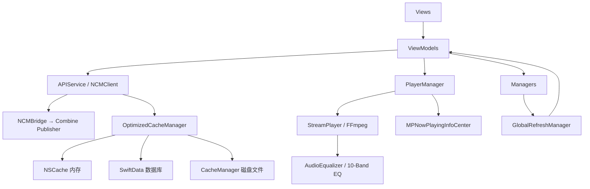

# AsideMusic 代码审计报告（2026-02-12，全面详细版）

## 审计范围

- 业务代码：Sources/AsideMusic 全部模块（Network、Database、Managers、ViewModels、Views、Models、Utils）
- SDK 层：FFmpegSwiftSDK（StreamPlayer、AudioEqualizer）
- 构建配置：Package.swift、AsideMusic.xcodeproj
- 未纳入：第三方依赖源码（NeteaseCloudMusicAPI-Swift、LiquidGlassEffect 内部实现）

## 项目概览

- UI：SwiftUI，Tab 切换使用 opacity 预加载策略
- 架构：MVVM + Singleton，ViewModel 通过 Combine 驱动 View
- 网络：NCMClient（NeteaseCloudMusicAPI-Swift）+ Combine Publisher 桥接
- 数据：SwiftData 三级降级（磁盘 → 重建 → 内存）+ 三级缓存（NSCache → SwiftData → 磁盘文件）
- 播放：FFmpegSwiftSDK StreamPlayer + AVAudioSession + MediaPlayer 远程控制
- 音频处理：10 段 Biquad Peaking EQ，24 个专业预设
- 依赖：SPM（FFmpegSwiftSDK、NeteaseCloudMusicAPI-Swift、LiquidGlassEffect）

## 架构分层

```
┌─────────────────────────────────────────────────┐
│  Presentation Layer                              │
│  Views / Components / AsideIcons / Theme         │
├─────────────────────────────────────────────────┤
│  ViewModel Layer                                 │
│  PlayerManager / HomeViewModel / LoginViewModel  │
│  MVViewModel / CommentViewModel                  │
├─────────────────────────────────────────────────┤
│  Manager Layer                                   │
│  EQManager / SubscriptionManager / CacheManager  │
│  GlobalRefreshManager / DataSyncCoordinator      │
│  OptimizedCacheManager / OrientationManager      │
├─────────────────────────────────────────────────┤
│  Network Layer                                   │
│  APIService / NCMBridge / APIService+Search/MV   │
├─────────────────────────────────────────────────┤
│  Data Layer                                      │
│  DatabaseManager / SongRepository                │
│  PlaylistRepository / HistoryRepository          │
├─────────────────────────────────────────────────┤
│  SDK Layer (FFmpegSwiftSDK)                      │
│  StreamPlayer / AudioRenderer / AudioEqualizer   │
│  ConnectionManager / PacketQueue                 │
└─────────────────────────────────────────────────┘
```

## 核心数据流



## 风险矩阵

| # | 类别 | 风险点 | 等级 | 影响面 | 优先级 |
|---|------|--------|------|--------|--------|
| 1 | 安全 | Cookie 明文存储在 UserDefaults | 🔴 高 | 账号安全 | P0 |
| 2 | 数据 | restoreState 丢失完整播放队列 | 🔴 高 | 用户体验 | P0 |
| 3 | 性能 | @MainActor 上执行数据库批量 I/O | 🟡 中 | UI 流畅度 | P1 |
| 4 | 代码 | CachePolicy 参数为死代码 | 🟡 中 | 代码质量 | P1 |
| 5 | 代码 | WaveformProgressBar 重复实现 | 🟡 中 | 维护成本 | P1 |
| 6 | 性能 | 双 NSCache 实例（200MB 上限） | 🟡 中 | 内存占用 | P1 |
| 7 | 并发 | DataSyncCoordinator continuation 泄漏风险 | 🟡 中 | 内存泄漏 | P1 |
| 8 | 逻辑 | 异常结束检测条件过于宽松 | 🟡 中 | 播放体验 | P1 |
| 9 | 逻辑 | EQManager 与 PlayerManager 单例初始化循环依赖 | 🟡 中 | 启动稳定性 | P1 |
| 10 | 逻辑 | SubscriptionManager 乐观更新竞态 | 🟡 中 | 数据一致性 | P1 |
| 11 | 代码 | NotificationCenter 字符串通知名 | 🟢 低 | 可维护性 | P2 |
| 12 | 代码 | Tab.icon SF Symbol 死代码 | 🟢 低 | 代码整洁 | P2 |
| 13 | 架构 | 全局单例紧耦合 | 🟢 低 | 可测试性 | P2 |
| 14 | 性能 | TimelineView 后台持续重绘 | 🟢 低 | 电池消耗 | P2 |


## 详细问题分析

---

### 🔴 P0-1：Cookie 明文存储在 UserDefaults

**文件**：`Network/APIService.swift`

**现状**：
```swift
var currentCookie: String? {
    get { UserDefaults.standard.string(forKey: cookieKey) }
    set { UserDefaults.standard.set(newValue, forKey: cookieKey) }
}
```

**风险**：
- UserDefaults 的 plist 文件在越狱设备上可直接读取
- iTunes 备份默认包含 UserDefaults 数据，Cookie 可能被提取
- 不具备系统级加密保护

**修复方案**：
- 迁移到 Keychain 存储，使用 `kSecAttrAccessibleAfterFirstUnlock`
- 启动时检查 UserDefaults 旧值，迁移后删除
- 登出时清空 Keychain 中的 cookie 和 uid

**验收标准**：
- UserDefaults 中不再出现 cookie/uid
- 重启 App 后登录态可恢复
- 登出后 Keychain 相关项被清空

---

### 🔴 P0-2：restoreState 丢失完整播放队列

**文件**：`ViewModels/PlayerManager.swift`

**现状**：
```swift
// PlayerState 只保存了 currentSong、userQueue、mode、history、playSource
// 没有保存 context（完整播放列表）和 contextIndex

private func restoreState() {
    // ...
    if let song = state.currentSong {
        self.currentSong = song
        self.context = [song]        // ← 只恢复了当前歌曲
        self.contextIndex = 0
    }
}
```

**影响**：
- 重启 App 后，用户之前的播放列表（可能有几十首歌）全部丢失
- 只剩当前一首歌，无法切换到队列中的其他歌曲
- 上一首/下一首功能在重启后失效

**修复方案**：
```swift
struct PlayerState: Codable {
    let currentSong: Song?
    let context: [Song]           // ← 新增
    let contextIndex: Int         // ← 新增
    let userQueue: [Song]
    let mode: PlayMode
    let history: [Song]
    let playSource: PlaySource?
}
```
- 保存时序列化完整 context 和 contextIndex
- 恢复时重建完整播放队列
- 考虑 context 过大时的截断策略（如最多保存 200 首）

---

### 🟡 P1-3：@MainActor 上执行数据库批量 I/O

**文件**：`Managers/OptimizedCacheManager.swift`、`Database/DatabaseManager.swift`

**现状**：
```swift
@MainActor
final class OptimizedCacheManager: ObservableObject {
    // songRepo.save(songs:) 在主线程执行
    func cacheSongs(_ songs: [Song]) {
        for song in songs {
            let cacheKey = "song_\(song.id)" as NSString
            memoryCache.setObject(song as AnyObject, forKey: cacheKey)
        }
        Task.detached { @MainActor in
            self.songRepo.save(songs: songs)  // ← 仍然在 MainActor 上
        }
    }
}
```

`Task.detached { @MainActor in }` 实际上仍然在主线程执行，`detached` 只是脱离了当前 Task 的优先级继承，但 `@MainActor` 又把它拉回主线程。

**影响**：
- 批量保存几十首歌曲时可能造成 UI 卡顿
- 特别是登录后首次同步大量数据时

**修复方案**：
- 使用 SwiftData 的 `ModelActor` 在后台线程执行批量写入
- 或者使用独立的 `ModelContext`（非 mainContext）在后台队列操作
- 内存缓存更新保留在主线程，数据库写入移到后台

---

### 🟡 P1-4：CachePolicy 参数为死代码

**文件**：`Network/APIService.swift`

**现状**：
```swift
func fetchDailySongs(cachePolicy: CachePolicy = .networkOnly, ttl: TimeInterval? = nil) 
    -> AnyPublisher<[Song], Error> {
    // cachePolicy 和 ttl 完全没有被使用
    ncm.fetch([Song].self, keyPath: "data.dailySongs") { [ncm] in
        try await ncm.recommendSongs()
    }
}

func fetchPlaylistTracks(id: Int, limit: Int = 30, offset: Int = 0, 
    cachePolicy: CachePolicy = .networkOnly, ttl: TimeInterval? = nil) 
    -> AnyPublisher<[Song], Error> {
    // 同样未使用
}
```

`CachePolicy` 枚举定义了 4 种策略（networkOnly、returnCacheDataElseLoad、returnCacheDataDontLoad、staleWhileRevalidate），但没有任何方法实际使用这些参数。

**修复方案**：
- 方案 A：移除未使用的参数和 `CachePolicy` 枚举，缓存逻辑已由 `OptimizedCacheManager.smartFetch` 承担
- 方案 B：在 NCMBridge 层实现缓存策略拦截

---

### 🟡 P1-5：WaveformProgressBar 重复实现

**文件**：`Views/FullScreenPlayerView.swift`、`Views/PersonalFMView.swift`

两个文件中各有一份几乎完全相同的 `WaveformProgressBar` 实现（约 60 行），仅在 `barCount`、`barSpacing`、`minHeight` 等参数上有细微差异。

**修复方案**：
- 提取为 `Views/Components/WaveformProgressBar.swift` 共享组件
- 通过参数控制 barCount、spacing 等差异
- 两处引用改为使用共享组件

---

### 🟡 P1-6：双 NSCache 实例

**文件**：`Managers/OptimizedCacheManager.swift`、`Managers/CacheManager.swift`

**现状**：
- `OptimizedCacheManager` 有自己的 `NSCache`（100MB、200 条）
- `CacheManager` 也有自己的 `NSCache`（100MB、100 条）
- `OptimizedCacheManager` 内部引用 `CacheManager.shared` 作为 L3 磁盘缓存
- 两个 NSCache 可能缓存相同的数据（如 `daily_songs`），造成内存浪费

**修复方案**：
- 统一为单一缓存管理器，`CacheManager` 降级为纯磁盘缓存工具
- 或者让 `OptimizedCacheManager` 的通用对象缓存直接使用 `CacheManager` 的 NSCache，避免双份内存缓存

---

### 🟡 P1-7：DataSyncCoordinator continuation 泄漏风险

**文件**：`Managers/DataSyncCoordinator.swift`

**现状**：
```swift
private func syncDailySongs() async -> [Song] {
    return await withCheckedContinuation { continuation in
        apiService.fetchDailySongs()
            .sink(
                receiveCompletion: { completion in
                    if case .failure = completion {
                        continuation.resume(returning: [])
                    }
                },
                receiveValue: { songs in
                    // ...
                    continuation.resume(returning: songs)
                }
            )
            .store(in: &cancellables)
    }
}
```

**风险**：
- 如果 Publisher 正常完成（`.finished`）但没有发出任何值，`receiveCompletion` 中的 `.finished` 分支没有处理，continuation 永远不会被 resume
- `store(in: &cancellables)` 不会取消旧的 subscription，如果 `syncAllCoreData()` 被多次调用，旧的 continuation 可能泄漏

**修复方案**：
```swift
receiveCompletion: { completion in
    switch completion {
    case .failure:
        continuation.resume(returning: [])
    case .finished:
        break  // receiveValue 已经 resume 了
    }
}
```
- 或者改用 `async/await` 版本的 NCMBridge（已有 `Publisher.async()` 扩展）

---

### 🟡 P1-8：异常结束检测条件过于宽松

**文件**：`ViewModels/PlayerManager.swift` → `StreamPlayerDelegateAdapter`

**现状**：
```swift
case .stopped:
    // ...
    let playedRatio = pm.duration > 0 ? pm.currentTime / pm.duration : 0
    if pm.duration > 0 && playedRatio < 0.5 && pm.currentTime < 30 {
        // 判定为异常结束，重新播放
        pm.loadAndPlay(song: song)
    } else {
        // 正常结束，自动下一首
        pm.playerDidFinishPlaying()
    }
```

**问题**：
- 一首 60 秒的歌播放了 29 秒后连接中断 → `playedRatio = 0.48 < 0.5` 且 `currentTime = 29 < 30` → 被判定为异常，触发重新播放而非跳下一首
- 一首 10 秒的短音频正常播放完毕 → `playedRatio = 1.0 > 0.5` → 正确判定为正常结束（这个 case 没问题）

**修复方案**：
- 改为 `playedRatio < 0.3 && pm.currentTime < 10`，更保守地判断异常
- 或者让 SDK 层区分 EOF（正常结束）和连接中断（异常结束），通过不同的状态码传递

---

### 🟡 P1-9：EQManager 与 PlayerManager 单例初始化循环依赖

**文件**：`Managers/EQManager.swift`

**现状**：
```swift
// EQManager.init() 中调用 restoreState()
private func restoreState() {
    // ...
    if isEnabled, let preset = currentPreset {
        preset.apply(to: PlayerManager.shared.equalizer)
        // ← 如果 EQManager 先于 PlayerManager 被访问，
        //    这里会触发 PlayerManager.init()
    }
}
```

`EQManager.shared` 和 `PlayerManager.shared` 互相引用：
- `EQManager` 在 `restoreState` 中访问 `PlayerManager.shared.equalizer`
- `PlayerManager` 在 `init` 中不直接引用 `EQManager`，但 `EQSettingsView` 同时使用两者

**风险**：虽然 Swift 的 `static let` 是线程安全的懒初始化，不会死锁，但初始化顺序不确定可能导致 EQ 状态恢复时 PlayerManager 的 StreamPlayer 还未完全就绪。

**修复方案**：
- `EQManager.restoreState()` 延迟 EQ 应用，等到首次播放时再 apply
- 或者在 `AsideMusicApp.onAppear` 中显式控制初始化顺序

---

### 🟡 P1-10：SubscriptionManager 乐观更新竞态

**文件**：`Managers/SubscriptionManager.swift`

**现状**：
```swift
func toggleRadioSubscription(_ radio: RadioStation) {
    let isCurrently = isRadioSubscribed(radio.id)
    let targetState = !isCurrently
    
    // 乐观更新
    if targetState {
        subscribedRadioIds.insert(radio.id)
    } else {
        subscribedRadioIds.remove(radio.id)
    }
    
    // 网络请求
    apiService.subscribeDJ(rid: radio.id, subscribe: targetState)
        .sink(receiveCompletion: { completion in
            if case .failure = completion {
                // 回滚
            }
        }, receiveValue: { _ in })
        .store(in: &cancellables)
}
```

**问题**：用户快速连续点击两次：
1. 第一次：`isCurrently = false` → 乐观更新为 `true` → 发起订阅请求
2. 第二次：`isCurrently = true`（乐观更新后）→ 乐观更新为 `false` → 发起取消请求
3. 第一次请求失败 → 回滚为 `false`（与第二次的乐观更新一致，看似正确）
4. 第二次请求成功 → 最终状态 `false`

但如果第一次成功、第二次失败：
1. 第一次成功 → 服务端为 `true`
2. 第二次失败 → 回滚为 `true`（本地）
3. 本地 `true`，服务端 `true` → 看似一致，但用户意图是取消

**修复方案**：
- 添加 debounce 或 loading 状态，防止快速连续操作
- 或者使用请求序列号，只处理最新请求的回滚


---

## 模块审计细节

### Network 层（APIService + NCMBridge）

**架构**：
- `NCMClient` 提供 async/await API，通过 `NCMBridge` 桥接为 Combine Publisher
- `APIService` 作为统一入口，封装所有业务接口
- 支持后端代理模式（Node.js 中间层）和直连模式

**优点**：
- NCMBridge 的 `Publisher → async/await` 桥接实现正确，使用 `didResume` 标志防止重复 resume
- `ncm.fetch` 泛型方法支持 keyPath 解码，减少样板代码
- 解灰功能通过 `UnblockManager` 插件化实现，可动态开关

**问题**：
1. Cookie 存储（见 P0-1）
2. CachePolicy 死代码（见 P1-4）
3. `postToBackend` 静态方法直接访问 `APIService.shared.currentCookie`，破坏了方法的独立性
4. 登出流程中 `currentCookie = nil` 触发 `currentUserId = nil` 的级联 didSet，逻辑隐晦

**文件清单**：
- `APIService.swift`（1070 行）— 主服务，包含认证、首页、歌单、歌手、用户、歌词、收藏、评论等全部接口
- `APIService+Search.swift` — 搜索相关接口
- `APIService+MV.swift` — MV 相关接口
- `NCMBridge.swift` — NCMClient ↔ Combine 桥接层

---

### 播放器引擎（PlayerManager + StreamPlayer）

**架构**：
- `PlayerManager`（@MainActor 单例）管理播放状态、队列、远程控制
- `StreamPlayer`（FFmpegSwiftSDK）负责实际音频解码和渲染
- `StreamPlayerDelegateAdapter` 桥接 SDK 回调到主线程
- 10 段 Biquad Peaking EQ 集成在 AudioRenderer pipeline 中

**优点**：
- 播放会话 ID 机制（`playbackSessionId`）有效防止切歌时的竞态条件
- seek debounce（50ms）避免快速拖动时的频繁 seek
- 无缝切歌：`prepareNext` + `switchToNext` 预加载下一首
- 音质切换：保留播放进度，通过 `pendingQualitySwitchSeek` 标记
- 连续失败退避：指数退避 + 最大失败次数保护
- 媒体服务重置恢复：监听 `mediaServicesWereResetNotification`，自动重建 audio session

**问题**：
1. restoreState 丢失播放队列（见 P0-2）
2. 异常结束检测条件宽松（见 P1-8）
3. 音质切换轮询机制（`pollAndSwitch`）使用递归 `asyncAfter`，不够优雅
4. `timeUpdateTimer` 在非播放状态仍在运行（有 guard 保护，但 Timer 本身消耗资源）
5. `error` 状态下 `consecutiveFailures >= maxConsecutiveFailures` 时重置计数器但无 UI 提示

**文件清单**：
- `PlayerManager.swift`（1118 行）— 播放管理器 + StreamPlayerDelegateAdapter

---

### 缓存系统（OptimizedCacheManager + CacheManager）

**架构**：
```
请求 → OptimizedCacheManager
         ├─ L1: NSCache（内存，100MB / 200条）
         ├─ L2: SwiftData（SongRepository / PlaylistRepository / HistoryRepository）
         └─ L3: CacheManager.shared（磁盘文件，SHA256 文件名）
                 └─ 自带 NSCache（内存，100MB / 100条）← 冗余
```

**优点**：
- `smartFetch` 方法实现了优雅的降级：内存 → 磁盘（带 TTL）→ 网络 → 过期缓存兜底
- 内存警告处理完善：清理 NSCache + CachedAsyncImage + LiquidGlassEngine
- 磁盘缓存文件名使用 SHA256，安全且无冲突
- 过期清理策略：按时间 + 按总大小（LRU）

**问题**：
1. 双 NSCache 冗余（见 P1-6）
2. @MainActor 上执行数据库 I/O（见 P1-3）
3. 磁盘缓存过期时间存储在文件的 `creationDate` 属性中，这是一个 hack，在文件复制/备份恢复后可能被重置
4. `CacheManager.init()` 不是 `@MainActor`，但被 `OptimizedCacheManager`（@MainActor）引用，Sendable 合规性需要关注

**文件清单**：
- `OptimizedCacheManager.swift` — 三级缓存管理器
- `CacheManager.swift` — 磁盘缓存 + 内存缓存
- `DatabaseManager.swift` — SwiftData 容器管理
- `Database/Repositories/` — SongRepository、PlaylistRepository、HistoryRepository

---

### 数据库层（DatabaseManager + Repositories）

**架构**：
- SwiftData 作为持久化层，7 个 Model（CachedSong、CachedPlaylist、CachedArtist、PlayHistory、SearchHistory、CachedLyrics、DownloadedSong）
- 三级降级初始化：磁盘数据库 → 删除损坏文件重建 → 内存数据库
- Repository 模式封装 CRUD 操作

**优点**：
- 三级降级确保 App 不会因数据库损坏而崩溃
- 最后的 `force_try` 用于内存数据库，合理（内存数据库不应失败）
- `cleanExpiredData` 使用 `#Predicate` 批量删除，效率好
- 同时删除 WAL 和 SHM 文件，清理彻底

**问题**：
- `DatabaseManager` 是 `@MainActor`，所有数据库操作在主线程（见 P1-3）
- `calculateDatabaseSize` 硬编码了 `default.store` 路径，如果 SwiftData 使用不同的文件名会返回 "0 MB"

---

### 数据同步（GlobalRefreshManager + DataSyncCoordinator）

**架构**：
- `GlobalRefreshManager` 统一管理刷新触发（登录、每日、手动、前台恢复）
- `DataSyncCoordinator` 协调网络请求与缓存同步
- 通过 Combine `PassthroughSubject` 发布刷新事件

**优点**：
- 刷新冷却机制（30 秒内不重复刷新）
- 每日刷新检测（跨天自动刷新）
- 进入后台时同步数据到数据库
- `smartSync` 方法支持缓存有效期检查

**问题**：
1. `waitForCoreDataReady` 使用 `Task.sleep` 轮询（100ms 间隔，8 秒超时），不够优雅
2. `DataSyncCoordinator` 的 continuation 泄漏风险（见 P1-7）
3. `HomeViewModel.fetchAllData` 中的 `checkAndMarkReady` 闭包捕获局部变量，多个异步回调修改同一组变量，逻辑复杂易遗漏

---

### EQ 均衡器（EQManager + EQPreset）

**架构**：
- 24 个内置预设（11 音乐风格 + 11 环绕音效 + 8 场景 + 4 人声 + 1 平坦）
- 支持自定义预设保存/删除
- 状态持久化到 OptimizedCacheManager
- 实时应用到 StreamPlayer 的 AudioEqualizer

**优点**：
- 预设参数基于专业音频工程标准，有详细的参考说明（Harman Target Curve、THX、Dolby Atmos 等）
- 10 段频率覆盖 31Hz-16kHz，增益范围 ±12dB
- 自定义预设使用 UUID 前缀避免 ID 冲突

**问题**：
1. 初始化循环依赖（见 P1-9）
2. `isEnabled` 的 `didSet` 中直接调用 `PlayerManager.shared.equalizer.reset()`，如果 PlayerManager 未初始化会触发其 init

---

### 订阅管理（SubscriptionManager）

**架构**：
- 管理播客订阅和歌单收藏
- 乐观更新 + 失败回滚模式
- 通过 `Set<Int>` 快速查询订阅状态

**优点**：
- 乐观更新提供即时 UI 反馈
- 失败时自动回滚
- 收藏成功后触发 Library 刷新

**问题**：
1. 快速连续操作的竞态（见 P1-10）
2. `fetchSubscribedRadios` 固定 limit=200，如果用户订阅超过 200 个播客会丢失数据

---

### UI 层

**架构**：
- 设计系统：AsideBackground、AsideIcon、AsideAlert、AsideLoadingView、AsideBouncingButtonStyle
- 颜色系统：Theme.swift 定义自适应颜色（light/dark）
- Tab 切换：opacity 预加载策略（4 个页面常驻内存）
- 浮动栏：UnifiedFloatingBar（MiniPlayer + TabBar 合一）
- 液态玻璃：LiquidGlassEffect 可选开关

**优点**：
- 设计系统组件化程度高，风格统一
- 自适应颜色使用 `UIColor { traitCollection in }` 实现，正确
- UnifiedFloatingBar 根据播放源（normal/fm/podcast）打开不同播放器
- TabBar 气泡动画使用 `offset` + `spring` 动画，流畅

**问题**：
1. WaveformProgressBar 重复实现（见 P1-5）
2. NotificationCenter 字符串通知名（见 P2-11）：
   ```swift
   NotificationCenter.default.post(name: .init("OpenFMPlayer"), object: nil)
   NotificationCenter.default.post(name: .init("OpenNormalPlayer"), object: nil)
   NotificationCenter.default.post(name: .init("OpenRadioPlayer"), object: radioId)
   NotificationCenter.default.post(name: .init("SwitchToLibrarySquare"), object: nil)
   ```
   应定义为 `Notification.Name` 常量
3. `Tab.icon` 属性返回 SF Symbol 字符串但未被使用（TabBar 已使用 AsideIcon 系统）
4. `ContentView` 中 4 个页面全部常驻内存，内存占用较高（但切换流畅）
5. `TimelineView(.animation(minimumInterval: 0.12))` 在 WaveformProgressBar 中持续触发重绘，即使 View 不可见

---

### 工具层（AppConfig + ErrorHandler）

**AppConfig**：
- 集中管理所有常量（缓存、API、播放器、UI、存储键、缓存键）
- 消除了魔法数字，良好

**ErrorHandler**：
- 统一错误处理：转换为 `AppError` → 日志记录 → UI 反馈
- 支持重试操作
- Combine 扩展 `.handleError()` 便捷方法
- `AppError` 提供用户友好的中文描述

**问题**：
- `ErrorHandler` 存在但未在所有 API 调用中一致使用。部分 ViewModel 直接 `AppLogger.error()` 而不经过 ErrorHandler

---

### 登录流程（LoginViewModel）

**架构**：
- 支持二维码登录和手机验证码登录
- 二维码：fetchQRKey → fetchQRCreate → 生成二维码图片 → 轮询 checkQRStatus
- 手机：sendCaptcha → loginCellphone

**优点**：
- 二维码支持两种模式：后端返回 base64 图片 / 客户端 CoreImage 生成
- 轮询间隔 3 秒，合理
- 过期检测（code 800）后停止轮询

**问题**：
- `deinit` 中 `timer?.cancel()` 可能不会被调用（SwiftUI 中 ViewModel 的 deinit 时机不确定）
- 登录成功后的状态同步分散在多处（`UserDefaults.set(true, forKey: "isLoggedIn")`、`NotificationCenter.post`、`GlobalRefreshManager.triggerLoginRefresh`），应该收敛到一个方法中

---

## 与上次审计（2026-02-07）的对比

| 项目 | 2026-02-07 状态 | 2026-02-12 状态 |
|------|----------------|----------------|
| 播放引擎 | AVFoundation/AVPlayer | ✅ 已迁移到 FFmpegSwiftSDK StreamPlayer |
| EQ 均衡器 | 无 | ✅ 新增 10 段 EQ + 24 预设 |
| 图标系统 | SF Symbols | ✅ 已迁移到 AsideIcon 自定义图标系统 |
| Cookie 存储 | UserDefaults（P0） | ⚠️ 仍未修复，仍在 UserDefaults |
| 数据库初始化 | fatalError 崩溃（P1） | ✅ 已修复，三级降级策略 |
| 强制解包 | 多处 force unwrap（P0） | ✅ 大部分已修复（`priv.id!` 仍存在于 Privilege 处理中） |
| HTTP 回退 | 存在（P0） | ✅ 已迁移到 NCMClient，由 SecureConfig 管理 |
| 播放队列持久化 | 未检查 | ⚠️ 新发现问题：丢失完整 context |

---

## 代码质量统计

| 指标 | 数值 |
|------|------|
| 核心业务代码行数（估算） | ~15,000 行 |
| View 文件数 | ~30 个 |
| ViewModel 文件数 | 5 个 |
| Manager 文件数 | 8 个 |
| Model 文件数 | 5 个 |
| Network 文件数 | 4 个 |
| Database 文件数 | 7 个 |
| 单例数量 | 10+ 个 |
| 单元测试覆盖 | 无实际测试用例 |

---

## 修复优先级总结

### P0（立即修复）
1. Cookie 迁移到 Keychain
2. PlayerState 持久化完整播放队列

### P1（近期修复）
3. 数据库批量 I/O 移到后台线程
4. 清理 CachePolicy 死代码
5. 提取 WaveformProgressBar 共享组件
6. 统一缓存层，消除双 NSCache
7. 修复 DataSyncCoordinator continuation 泄漏
8. 收紧异常结束检测条件
9. 解决 EQManager 初始化循环依赖
10. 添加订阅操作 debounce

### P2（长期优化）
11. NotificationCenter 通知名常量化
12. 清理 Tab.icon 死代码
13. 考虑依赖注入替代全局单例
14. WaveformProgressBar 后台暂停重绘
15. 补充单元测试

---

## 建议的下一步

1. 优先修复 P0 项（Cookie Keychain 迁移 + 播放队列持久化）
2. 补充核心路径的单元测试（播放器状态机、缓存策略、网络错误处理）
3. 引入 CI 流程（构建 + 静态分析 + 格式检查）
4. 考虑引入 SwiftLint 统一代码风格
